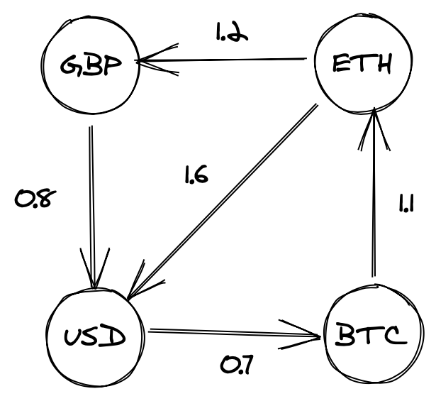

With all the interest over the last few years surrounding cryptocurrencies, paired with their naturally open nature, I thought this might be a nice topic for a series on currency arbitrage. Arbitrage, the practice of exploiting differences in prices of the same asset across multiple markets, is an area of finance particularly well suited to a computational approach. The theory is simple enough; we take an asset, say pork bellies, and find someone selling at one price (£1) and someone buying at another (£2) and simply buy from the first to immediately sell to the second, profiting ourselves £1. Applying this to currencies, the natural extension of this is to start applying this idea across multiple pairs; say we have 3 currencies GBP, USD & JPY (with quotes GPB/USD = 1.5, USD/JPY = 1, JPY/GBP = 1.5) if we trade these simultaneously (or very quickly) GBP->USD->JPY->GBP, we'd end up with more GBP than we started with, risk-free.

In this series we're going to look at developing an approach to pull market data for cryptocurrencies and identify arbitrage opportunities within this. This is quite a big topic so I'm going to spit this into a couple of posts, first laying down some theory and getting a starter implementation up and running, then we'll look into writing a feed for the data and feeding this into our calculator.

### Modeling the problem

We're going to be looking at currency pairs through the lens of graphs where the vertices will represent each currency and the edge weights will represent the quote values. Visualy, the example listed in the intro would look something like this:


At it's core, if we model our currencies as a graph, we're able to identify arbitrage opportunities by identifying cycles that when the weights are multiplied together, yield a result > 1.

Thankfully for us, graph theory is an extremely mature topic and there are a host of algorithms we can leverage to approach our problem; in this case we're going to explore the Bellman-Ford algorithm. Bellman-Ford is a really elegant little algorithm and a surprisingly simple exercise in dynamic programming, identifying the shortest path from a specific node to each of the nodes within the graph by progressively building out a picture of potential shortcuts. Clocking in with a worst case complexity of O(|V||E|), it's a fair bit slower than algorithms like Dijkstra's \[running in O(|E|+(|V|log|V|))\] however, critically in this case, it's able to cope with (and with a few small modifications, identify) negative weight cycles.

Take the following graph:


Bellman-Ford runs V-1 (at most, in this case we don't need to run this many) relaxations on each node to find the shortest distance to it. In our case we'd have something like this \[A->0, B->5, C->9, D->-1\].

If we update this so that the weights in our cycle (B->C->D->B) sum to a negative figure, eg:


we can now run this as many times as we want, our algorithm will never terminate at a fixed point; we've found a negative weight cycle.

Attempting to apply this to an example using currency pairs, for example the following:



doesn't quite help us, due to the fact that Bellman-Ford identifies _negative sum cycles_ and we're looking for _positive multiplicative cycles_; if we look at our example above, there's clearly an arbitrage opportunity (ETH -> USD -> BTC ->ETH) however a standard Bellman-Ford won't pick up any negative weight cycles. Fortunately there's an easy fix for this; by taking the log of each of our weights prior to processing, we can sum them as normal to find our negative cycles, then exponentiate our result at a later point if we want to calculate our yield. In the above case this looks something like:

```scala
scala> val (a,b,c) = (log(1.6), log(0.7), log(1.1))
a: Double = 0.47000362924573563
b: Double = -0.35667494393873245
c: Double = 0.09531017980432493

scala> val logSum = a+b+c
logSum: Double = 0.20863886511132812

scala> math.pow(math.E, logSum)
res9: Double = 1.232

scala> val target = 1.6 * 0.7 * 1.1 // quick sense check that we're able to recover our product successfully
target: Double = 1.232
```

As Bellman-Ford allows us to identify where we have _negative_ weight cycles, all we need to do at this point is take the negative log of our weights before we run our algorithm, and it will function as normal.

### Show me the money

My eventual aim with this series is to try to apply a distributed approach to the problem using Spark, so I'm going to use the GraphX data structures provided in Spark from the start. Our initial implementation is just going be a classic Bellman-Ford and looks like this:

```scala
import org.apache.spark.graphx.{Edge, Graph, VertexId}

import scala.annotation.tailrec

case class Reduction(distances: Map[VertexId, Double], previous: Map[VertexId, VertexId])

class BellmanFord {

  def relaxNonSpark(source: VertexId, graph: Graph[String, Double]) = {
    val verticesCount = graph.vertices.count()
    val edges = graph
      .edges
      .collect()

    @tailrec
    def relax(passes: Long, reduction: Reduction): Reduction =
      if (passes == 0) {
        reduction
      }
      else {
        relax(passes - 1, relaxOnce(edges, reduction))
      }

    relax(verticesCount, Reduction(Map(source -> 0d), Map[VertexId, VertexId]()))
  }

  def relaxOnce(edges: Array[Edge[Double]], reduction: Reduction) = {
    edges
      .foldLeft(reduction)((reduction, edge) => {
        val distances = reduction.distances
        val previous = reduction.previous
        (distances.get(edge.srcId), distances.get(edge.dstId)) match {
          case (None, _) => reduction
          case (Some(distanceToSrc), None) =>
            Reduction(distances + (edge.dstId -> (distanceToSrc + edge.attr)), previous + (edge.dstId -> edge.srcId))
          case (Some(distanceToSrc), Some(distanceToDst)) =>
            if (distanceToSrc + edge.attr < distanceToDst)
              Reduction(distances + (edge.dstId -> (distanceToSrc + edge.attr)), previous + (edge.dstId -> edge.srcId))
            else
              reduction
        }
      })
  }
}

```

And some tests to show it works:

```scala
import com.typesafe.scalalogging.Logger
import org.apache.spark.graphx.{Edge, Graph, VertexId}
import org.apache.spark.rdd.RDD
import org.apache.spark.sql.SparkSession
import org.scalatest.FunSuite

import scala.math.log

class BellmanFordTest extends FunSuite {

  private val logger = Logger[BellmanFordTest]

  private def vertexId(string: String) = string.hashCode.toLong

  private def vertexIdPair(string: String) = (string.hashCode.toLong, string)

  private val spark = SparkSession.builder
    .master("local[*]")
    .appName("Sample App")
    .getOrCreate()

  private val sc = spark.sparkContext

  private val vertices: RDD[(VertexId, String)] =
    sc.parallelize(Seq(vertexIdPair("A"), vertexIdPair("B"), vertexIdPair("C"), vertexIdPair("D")))

  private val bellman = new BellmanFord()

  test("Graph without negative cycle doesn't change with extra relaxations") {

    val edgesNonNeg: RDD[Edge[Double]] = sc.parallelize(Seq(
      Edge(vertexId("A"), vertexId("B"), 5),
      Edge(vertexId("A"), vertexId("D"), 3),
      Edge(vertexId("B"), vertexId("C"), 3),
      Edge(vertexId("C"), vertexId("D"), -10)
    ))

    val graphWithNoNegativeCycles = Graph(vertices, edgesNonNeg)
    val sourceVertexId = graphWithNoNegativeCycles.vertices.first()._1
    val reduction = bellman.relaxNonSpark(sourceVertexId, graphWithNoNegativeCycles)
    val additionalReduction = bellman.relaxOnce(edgesNonNeg.collect(), reduction)
    logger.info(s"Reduction distances: ${reduction.distances}")
    logger.info(s"Reduction previous map: ${reduction.previous}")
    assert(reduction === additionalReduction)
  }

  test("Graph containing negative cycle does change with extra relaxations") {
    val edgesWithNegativeCycle: RDD[Edge[Double]] = sc.parallelize(Seq(
      Edge(vertexId("A"), vertexId("B"), 5),
      Edge(vertexId("A"), vertexId("D"), 3),
      Edge(vertexId("B"), vertexId("C"), 3),
      Edge(vertexId("C"), vertexId("D"), -10),
      Edge(vertexId("D"), vertexId("C"), 4)
    ))

    val graphWithNegativeCycles = Graph(vertices, edgesWithNegativeCycle)
    val sourceVertexId = graphWithNegativeCycles.vertices.first()._1
    val reduction = bellman.relaxNonSpark(sourceVertexId, graphWithNegativeCycles)
    val additionalReduction = bellman.relaxOnce(edgesWithNegativeCycle.collect(), reduction)
    assert(reduction !== additionalReduction)
  }

  // note this test isn't complete, there's graphs this would fail for, this is just to validate our test data
  test("Graph with negative cycles under multiplication, but not addition, does not change with extra relaxation without preprocessing") {
    val edgesWithNegativeCycle: RDD[Edge[Double]] = sc.parallelize(Seq(
      Edge(vertexId("A"), vertexId("B"), 0.8),
      Edge(vertexId("B"), vertexId("C"), 0.7),
      Edge(vertexId("C"), vertexId("D"), 1.1),
      Edge(vertexId("D"), vertexId("A"), 1.2),
      Edge(vertexId("D"), vertexId("B"), 1.6)
    ))

    val graphWithNegativeCycles = Graph(vertices, edgesWithNegativeCycle)
    val sourceVertexId = graphWithNegativeCycles.vertices.first()._1
    val reduction = bellman.relaxNonSpark(sourceVertexId, graphWithNegativeCycles)
    val additionalReduction = bellman.relaxOnce(edgesWithNegativeCycle.collect(), reduction)
    assert(reduction === additionalReduction)
  }

  test("Graph with negative cycles under multiplication changes with extra relaxation when preprocessing applied") {
    val edgesWithNegativeCycle: RDD[Edge[Double]] = sc.parallelize(Seq(
      Edge(vertexId("A"), vertexId("B"), -log(0.8)),
      Edge(vertexId("B"), vertexId("C"), -log(0.7)),
      Edge(vertexId("C"), vertexId("D"), -log(1.1)),
      Edge(vertexId("D"), vertexId("A"), -log(1.2)),
      Edge(vertexId("D"), vertexId("B"), -log(1.6))
    ))

    val graphWithNegativeCycles = Graph(vertices, edgesWithNegativeCycle)
    val sourceVertexId = graphWithNegativeCycles.vertices.first()._1
    val reduction = bellman.relaxNonSpark(sourceVertexId, graphWithNegativeCycles)
    val additionalReduction = bellman.relaxOnce(edgesWithNegativeCycle.collect(), reduction)
    assert(reduction !== additionalReduction)
  }
}

```

As you can see, we pass our graph into `relaxNonSpark` with a given sourceId and our graph then recursively relax our edges N-1 times. As we reduce we're passing down a `Reduction` object, which contains a map of each node to it's (current) distance from source, and a map of each node to the predecessor from which it was last updated. Note: There are a number of optimisations we can make to our implementation straight off the bat, such as terminating early upon seeing no changes to our `Reduction` object between relaxations, however I've purposefully left these out for now.

### Conclusion

At this point we've seen how we can approach currency exchange from the perspective of graphs, and how to leverage this approach in such a way that we can identify opportunities for arbitrage. In the next part we'll write a small web-scraper to pull some real cryptocurrency data and apply this to our implementation to identify arbitrage opportunities, before building on this to leverage spark to distribute our problem.
