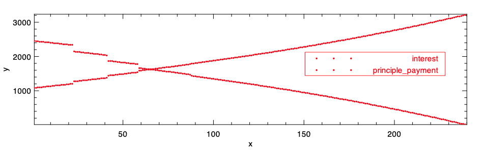

Interest-rate volatility is one of the most important factors anyone considers when taking out or changing their mortgage. One of the main things volatility can influence is the term of the mortgage, which can also vary significantly based on where you live. For example, in areas such as the Netherlands mortgages periods are typically significantly longer than those issued here in the United Kingdom, with 15-20 year terms not being unusual. One rather obvious benefit of this is that purchasers are shielded against rising rates — the inverse being that if rates fall you're stuck with what you started on. A potentially more subtle downside to this is that you can't benefit from any changes to your loan-to-value ratio; as you pay your mortgage off your mortgage your LTV decreases which may allow you to apply for better rates. This challenge is further compounded by the fact that you don't pay a static amount of interest every month due to mortgage amortisation, which we'll discuss this more below.

Some newer lenders have made efforts to offset this, such as the Dutch firm April who have recently started issuing mortgages which [automatically adjust your LTV](https://www.theguardian.com/money/2024/feb/08/mortgages-cut-rates-april-mortgages) as you pay them off — though interestingly don't provide much marketing information on just how much of a difference this can actually make. In the UK, shorter fixed-rate periods are more common so we potentially benefit from LTV changes automatically as fixed period cycles are shorter. Again however, the impact of this in relation to how these changes can interact with your mortgages overall cost isn't always made abundantly clear. The case we're going to be discussing here specifically, is how rate-changes can impact your overall mortgage cost can vary quite a bit based on when they happen over the lifetime of the mortgage.

### Some context on mortgage amortisation

Mortgage amortisation is the process by which lenders ensure that your mortgage payments remain stable over time. Without this in place, as you paid off more of the principal of the mortgage the percentage of interest being charged each month would amount to a different price as it would constantly be calculated against a different amount.

In order to calculate the overall mortgage schedule, we only need two functions :  
i. The total monthly payment each month  
ii. The amount that month that is going towards the monthly principal (the amount of interest being the difference)

i \= i n t e r e s t R a t e n \= n u m b e r O f M o n t h s R e m a i n i n g

t o t a l M o n t h l y P a y m e n t \= l o a n A m o u n t ( ( i × ( 1 + i ) 2 ) ( 1 + i ) n − 1 )

P r i n c i p a l P a y m e n t \= t o t a l M o n t h l y P a y m e n t − ( o u t s t a n d i n g L o a n B a l a n c e ∗ ( i / 12 ) ) )

From these we can calculate each month by iteratively calling `calc_total_monthly_payment` on the balance generated by the previous months output. Quickly testing this, we can see that it works (function implementations below in the main body of the code:

```
utop # let first_month_total_payment = calc_total_monthly_payment 100000. 0.4 10.
let first_month_principal = calc_total_monthly_principal first_month_total_payment 100000. 0.4
let second_month_total_total_payment = calc_total_monthly_payment (100000. -. first_month_principal) 0.4 9.;;

val first_month_total_payment : float = 11923.3425628468303
val first_month_principal : float = 8590.00922951349639
val second_month_total_total_payment : float = 11923.342562846834
```

Here we can see that when we recalculate the amount we should be paying each month, it's outputting the same amount (notice in this case it's not _exactly_ the same amount, this is due to some floating point arithmetic errors, but it's good enough for our purposes here, obviously don't do this in production!).

## Main analysis

First, let's set up a base line case. In this scenario we're going to imagine a mortgage running with a fixed rate over it's entire lifetime. To do this we're going to use the following:

mortgage.ml

```
open Types
module B = PrintBox

(* stolen from https://github.com/dbuenzli/gg/blob/8f761c278d0b2ee2adb94f9fbc033f1bfd76e536/src/gg.ml#L123-L126 *)
let round_dfrac d x =
  if x -. Float.round x = 0.
  then x
  else (
    (* x is an integer. *)
    let m = 10. ** float d in
    (* m moves 10^-d to 1. *)
    floor ((x *. m) +. 0.5) /. m)
;;

let format_rows (rows : row list) =
  let get_row_arr r =
    let year, month = r.year_month in
    [| B.int year
     ; B.int month
     ; B.float @@ round_dfrac 2 r.payment
     ; B.float @@ round_dfrac 2 r.interest
     ; B.float @@ round_dfrac 2 r.principle
     ; B.float @@ round_dfrac 2 r.loan_balance
     ; B.float @@ round_dfrac 2 r.end_period_balance
    |]
  in
  let rec get_rows rows converted_rows =
    match rows with
    | [] -> converted_rows
    | [ r ] -> get_row_arr r :: converted_rows
    | r :: xr -> get_rows xr (get_row_arr r :: converted_rows)
  in
  let output = get_rows rows [] in
  let output_with_headers =
    Array.of_list
    @@ ([| B.sprintf "Year"
         ; B.sprintf "Month"
         ; B.sprintf "Payment"
         ; B.sprintf "Interest"
         ; B.sprintf "Principle"
         ; B.sprintf "Loan balance"
         ; B.sprintf "End period balance"
        |]
        :: output)
  in
  output_with_headers |> B.grid
;;

let calc_total_monthly_payment principal annual_interest number_of_payments =
  let monthly_interest = annual_interest /. 12.0 in
  let numerator =
    monthly_interest *. Float.pow (1.0 +. monthly_interest) number_of_payments
  in
  let denominator = Float.pow (1.0 +. monthly_interest) number_of_payments -. 1.0 in
  principal *. (numerator /. denominator)
;;

let calc_total_monthly_principal total_monthly_payment outstanding_balance interest_rate =
  let monthly_interest_rate = interest_rate /. 12. in
  total_monthly_payment -. (outstanding_balance *. monthly_interest_rate)
;;

let calculate_rows principal interest_rate term_years =
  let total_number_of_payments = float_of_int @@ (term_years * 12) in
  let calculate_month year month remaining_balance =
    let total_monthly_payment =
      (* calc_total_monthly_payment principal interest_rate number_of_payments *)
      calc_total_monthly_payment principal interest_rate total_number_of_payments
    in
    let monthly_principal =
      calc_total_monthly_principal total_monthly_payment remaining_balance interest_rate
    in
    { year_month = year, month
    ; loan_balance = remaining_balance
    ; payment = total_monthly_payment
    ; interest = total_monthly_payment -. monthly_principal
    ; principle = monthly_principal
    ; end_period_balance = remaining_balance -. monthly_principal
    }
  in
  let rec calc_all_months outstanding_balance year month schedule months_calculated =
    if total_number_of_payments <= months_calculated
    then schedule
    else (
      let next_month_details = calculate_month year month outstanding_balance in
      let next_year = if month == 12 then year + 1 else year in
      let next_month = if month == 12 then 1 else month + 1 in
      let new_outstanding_balance = next_month_details.end_period_balance in
      let updated_schedule = next_month_details :: schedule in
      calc_all_months
        new_outstanding_balance
        next_year
        next_month
        updated_schedule
        (months_calculated +. 1.))
  in
  calc_all_months principal 0 1 [] 0.
;;

let calc_summary principal rows =
  let total_cost =
    let rec calc_total_cost rows sum_so_far =
      match rows with
      | [] -> sum_so_far
      | [ r ] -> calc_total_cost [] (sum_so_far +. r.payment)
      | r :: rs -> calc_total_cost rs (sum_so_far +. r.payment)
    in
    calc_total_cost rows 0.
  in
  { Summary.total_cost;
  principal}
;;
```

and following `plot.ml` for plotting our output:

```
open Owl
open Owl_plplot
open Types

let graph rows =
  let x_axis_months =
    Array.of_list
    @@ List.map
         (fun row ->
           let year, month = row.year_month in
           float_of_int @@ ((year * 12) + month))
         rows
  in
  let end_balance_by_month =
    Array.of_list @@ List.map (fun row -> row.end_period_balance) rows
  in
  let interest_by_month = Array.of_list @@ List.map (fun row -> row.interest) rows in
  let principle_by_month = Array.of_list @@ List.map (fun row -> row.principle) rows in
  let x_axis = Mat.of_array x_axis_months (Array.length x_axis_months) 1 in
  let y_axis_end_balance =
    Mat.of_array end_balance_by_month (Array.length end_balance_by_month) 1
  in
  let y_axis_interest =
    Mat.of_array interest_by_month (Array.length interest_by_month) 1
  in
  let y_axis_principle =
    Mat.of_array principle_by_month (Array.length principle_by_month) 1
  in
  let h = Plot.create ~m:2 ~n:1 "output.pdf" in
  Plot.subplot h 0 0;
  (* Plot.set_foreground_color h 0 50 255; *)
  (* Plot.set_background_color h 0 0 0; *)
  Plot.set_page_size h 1000 1000;
  Plot.(
    plot
      ~h
      ~spec:[ RGB (255, 0, 0); LineStyle 1; Marker "#[0x2299]"; MarkerSize 8. ]
      x_axis
      y_axis_end_balance);
  Plot.(legend_on h ~position:NorthEast [| "remaining-balance" |]);
  Plot.subplot h 1 0;
  Plot.(scatter ~h ~spec:[ RGB (255, 0, 0); LineStyle 1 ] x_axis y_axis_interest);
  Plot.(scatter ~h ~spec:[ RGB (255, 0, 0); LineStyle 2 ] x_axis y_axis_principle);
  Plot.(legend_on h ~position:East [| "interest"; "principle_payment" |]);
  Plot.output h
;;
```

then our resulting `main.ml` looks something like:

```
module B = PrintBox
open Mortgage__Types

let principal = 500000.0
let interest_rate = 0.0591
let term = 20
let rows = Mortgage.calculate_rows principal interest_rate term
let summary = Mortgage.calc_summary principal rows;;

PrintBox_text.output ~style:true stdout @@ Mortgage.format_rows rows;;
print_endline "";;
Mortgage__Plot.graph rows

let () = print_endline (Summary.show summary)
```

We can see from the configuration in our main, that we're running against a £500000 mortgage, to be paid over 20 years, at a fixed rate of 5.91%. Running, this produces the following amortisation schedule.

`Year│Month│Payment│Interest│Principle│Loan balance│End period balance ────┼─────┼───────┼────────┼─────────┼────────────┼────────────────── 0 │1 │3556.24│2462.5 │1093.74 │500000. │498906.26 ────┼─────┼───────┼────────┼─────────┼────────────┼────────────────── 0 │2 │3556.24│2457.11 │1099.13 │498906.26 │497807.13 ────┼─────┼───────┼────────┼─────────┼────────────┼────────────────── 0 │3 │3556.24│2451.7 │1104.54 │497807.13 │496702.58 ────┼─────┼───────┼────────┼─────────┼────────────┼────────────────── 0 │4 │3556.24│2446.26 │1109.98 │496702.58 │495592.6 ────┼─────┼───────┼────────┼─────────┼────────────┼────────────────── 0 │5 │3556.24│2440.79 │1115.45 │495592.6 │494477.15 ────┼─────┼───────┼────────┼─────────┼────────────┼────────────────── 0 │6 │3556.24│2435.3 │1120.94 │494477.15 │493356.21 ────┼─────┼───────┼────────┼─────────┼────────────┼────────────────── 0 │7 │3556.24│2429.78 │1126.46 │493356.21 │492229.75 ────┼─────┼───────┼────────┼─────────┼────────────┼────────────────── 0 │8 │3556.24│2424.23 │1132.01 │492229.75 │491097.73 ────┼─────┼───────┼────────┼─────────┼────────────┼────────────────── 0 │9 │3556.24│2418.66 │1137.59 │491097.73 │489960.15 ────┼─────┼───────┼────────┼─────────┼────────────┼────────────────── 0 │10 │3556.24│2413.05 │1143.19 │489960.15 │488816.96 ────┼─────┼───────┼────────┼─────────┼────────────┼────────────────── 0 │11 │3556.24│2407.42 │1148.82 │488816.96 │487668.14 ────┼─────┼───────┼────────┼─────────┼────────────┼────────────────── 0 │12 │3556.24│2401.77 │1154.48 │487668.14 │486513.66 ────┼─────┼───────┼────────┼─────────┼────────────┼────────────────── 1 │1 │3556.24│2396.08 │1160.16 │486513.66 │485353.5 ────┼─────┼───────┼────────┼─────────┼────────────┼────────────────── 1 │2 │3556.24│2390.37 │1165.88 │485353.5 │484187.62 ────┼─────┼───────┼────────┼─────────┼────────────┼────────────────── 1 │3 │3556.24│2384.62 │1171.62 │484187.62 │483016. ────┼─────┼───────┼────────┼─────────┼────────────┼────────────────── 1 │4 │3556.24│2378.85 │1177.39 │483016. │481838.61 ────┼─────┼───────┼────────┼─────────┼────────────┼────────────────── 1 │5 │3556.24│2373.06 │1183.19 │481838.61 │480655.42 ────┼─────┼───────┼────────┼─────────┼────────────┼────────────────── 1 │6 │3556.24│2367.23 │1189.02 │480655.42 │479466.41 ────┼─────┼───────┼────────┼─────────┼────────────┼────────────────── 1 │7 │3556.24│2361.37 │1194.87 │479466.41 │478271.54 ────┼─────┼───────┼────────┼─────────┼────────────┼────────────────── 1 │8 │3556.24│2355.49 │1200.76 │478271.54 │477070.78 ────┼─────┼───────┼────────┼─────────┼────────────┼────────────────── 1 │9 │3556.24│2349.57 │1206.67 │477070.78 │475864.11 ────┼─────┼───────┼────────┼─────────┼────────────┼────────────────── 1 │10 │3556.24│2343.63 │1212.61 │475864.11 │474651.5 ────┼─────┼───────┼────────┼─────────┼────────────┼────────────────── 1 │11 │3556.24│2337.66 │1218.58 │474651.5 │473432.92 ────┼─────┼───────┼────────┼─────────┼────────────┼────────────────── 1 │12 │3556.24│2331.66 │1224.59 │473432.92 │472208.33 ────┼─────┼───────┼────────┼─────────┼────────────┼────────────────── 2 │1 │3556.24│2325.63 │1230.62 │472208.33 │470977.71 ────┼─────┼───────┼────────┼─────────┼────────────┼────────────────── 2 │2 │3556.24│2319.57 │1236.68 │470977.71 │469741.03 ────┼─────┼───────┼────────┼─────────┼────────────┼────────────────── 2 │3 │3556.24│2313.47 │1242.77 │469741.03 │468498.27 ────┼─────┼───────┼────────┼─────────┼────────────┼────────────────── 2 │4 │3556.24│2307.35 │1248.89 │468498.27 │467249.38 ────┼─────┼───────┼────────┼─────────┼────────────┼────────────────── 2 │5 │3556.24│2301.2 │1255.04 │467249.38 │465994.34 ────┼─────┼───────┼────────┼─────────┼────────────┼────────────────── 2 │6 │3556.24│2295.02 │1261.22 │465994.34 │464733.12 ────┼─────┼───────┼────────┼─────────┼────────────┼────────────────── 2 │7 │3556.24│2288.81 │1267.43 │464733.12 │463465.68 ────┼─────┼───────┼────────┼─────────┼────────────┼────────────────── 2 │8 │3556.24│2282.57 │1273.67 │463465.68 │462192.01 ────┼─────┼───────┼────────┼─────────┼────────────┼────────────────── 2 │9 │3556.24│2276.3 │1279.95 │462192.01 │460912.06 ────┼─────┼───────┼────────┼─────────┼────────────┼────────────────── 2 │10 │3556.24│2269.99 │1286.25 │460912.06 │459625.81 ────┼─────┼───────┼────────┼─────────┼────────────┼────────────────── 2 │11 │3556.24│2263.66 │1292.59 │459625.81 │458333.22 ────┼─────┼───────┼────────┼─────────┼────────────┼────────────────── 2 │12 │3556.24│2257.29 │1298.95 │458333.22 │457034.27 ────┼─────┼───────┼────────┼─────────┼────────────┼────────────────── 3 │1 │3556.24│2250.89 │1305.35 │457034.27 │455728.92 ────┼─────┼───────┼────────┼─────────┼────────────┼────────────────── 3 │2 │3556.24│2244.46 │1311.78 │455728.92 │454417.15 ────┼─────┼───────┼────────┼─────────┼────────────┼────────────────── 3 │3 │3556.24│2238. │1318.24 │454417.15 │453098.91 ────┼─────┼───────┼────────┼─────────┼────────────┼────────────────── 3 │4 │3556.24│2231.51 │1324.73 │453098.91 │451774.18 ────┼─────┼───────┼────────┼─────────┼────────────┼────────────────── 3 │5 │3556.24│2224.99 │1331.26 │451774.18 │450442.92 ────┼─────┼───────┼────────┼─────────┼────────────┼────────────────── 3 │6 │3556.24│2218.43 │1337.81 │450442.92 │449105.11 ────┼─────┼───────┼────────┼─────────┼────────────┼────────────────── 3 │7 │3556.24│2211.84 │1344.4 │449105.11 │447760.71 ────┼─────┼───────┼────────┼─────────┼────────────┼────────────────── 3 │8 │3556.24│2205.22 │1351.02 │447760.71 │446409.69 ────┼─────┼───────┼────────┼─────────┼────────────┼────────────────── 3 │9 │3556.24│2198.57 │1357.68 │446409.69 │445052.01 ────┼─────┼───────┼────────┼─────────┼────────────┼────────────────── 3 │10 │3556.24│2191.88 │1364.36 │445052.01 │443687.65 ────┼─────┼───────┼────────┼─────────┼────────────┼────────────────── 3 │11 │3556.24│2185.16 │1371.08 │443687.65 │442316.57 ────┼─────┼───────┼────────┼─────────┼────────────┼────────────────── 3 │12 │3556.24│2178.41 │1377.83 │442316.57 │440938.73 ────┼─────┼───────┼────────┼─────────┼────────────┼────────────────── 4 │1 │3556.24│2171.62 │1384.62 │440938.73 │439554.11 ────┼─────┼───────┼────────┼─────────┼────────────┼────────────────── 4 │2 │3556.24│2164.8 │1391.44 │439554.11 │438162.68 ────┼─────┼───────┼────────┼─────────┼────────────┼────────────────── 4 │3 │3556.24│2157.95 │1398.29 │438162.68 │436764.38 ────┼─────┼───────┼────────┼─────────┼────────────┼────────────────── 4 │4 │3556.24│2151.06 │1405.18 │436764.38 │435359.2 ────┼─────┼───────┼────────┼─────────┼────────────┼────────────────── 4 │5 │3556.24│2144.14 │1412.1 │435359.2 │433947.11 ────┼─────┼───────┼────────┼─────────┼────────────┼────────────────── 4 │6 │3556.24│2137.19 │1419.05 │433947.11 │432528.05 ────┼─────┼───────┼────────┼─────────┼────────────┼────────────────── 4 │7 │3556.24│2130.2 │1426.04 │432528.05 │431102.01 ────┼─────┼───────┼────────┼─────────┼────────────┼────────────────── 4 │8 │3556.24│2123.18 │1433.07 │431102.01 │429668.94 ────┼─────┼───────┼────────┼─────────┼────────────┼────────────────── 4 │9 │3556.24│2116.12 │1440.12 │429668.94 │428228.82 ────┼─────┼───────┼────────┼─────────┼────────────┼────────────────── 4 │10 │3556.24│2109.03 │1447.22 │428228.82 │426781.6 ────┼─────┼───────┼────────┼─────────┼────────────┼────────────────── 4 │11 │3556.24│2101.9 │1454.34 │426781.6 │425327.26 ────┼─────┼───────┼────────┼─────────┼────────────┼────────────────── 4 │12 │3556.24│2094.74 │1461.51 │425327.26 │423865.75 ────┼─────┼───────┼────────┼─────────┼────────────┼────────────────── 5 │1 │3556.24│2087.54 │1468.7 │423865.75 │422397.05 ────┼─────┼───────┼────────┼─────────┼────────────┼────────────────── 5 │2 │3556.24│2080.31 │1475.94 │422397.05 │420921.11 ────┼─────┼───────┼────────┼─────────┼────────────┼────────────────── 5 │3 │3556.24│2073.04 │1483.21 │420921.11 │419437.91 ────┼─────┼───────┼────────┼─────────┼────────────┼────────────────── 5 │4 │3556.24│2065.73 │1490.51 │419437.91 │417947.39 ────┼─────┼───────┼────────┼─────────┼────────────┼────────────────── 5 │5 │3556.24│2058.39 │1497.85 │417947.39 │416449.54 ────┼─────┼───────┼────────┼─────────┼────────────┼────────────────── 5 │6 │3556.24│2051.01 │1505.23 │416449.54 │414944.31 ────┼─────┼───────┼────────┼─────────┼────────────┼────────────────── 5 │7 │3556.24│2043.6 │1512.64 │414944.31 │413431.67 ────┼─────┼───────┼────────┼─────────┼────────────┼────────────────── 5 │8 │3556.24│2036.15 │1520.09 │413431.67 │411911.58 ────┼─────┼───────┼────────┼─────────┼────────────┼────────────────── 5 │9 │3556.24│2028.66 │1527.58 │411911.58 │410384. ────┼─────┼───────┼────────┼─────────┼────────────┼────────────────── 5 │10 │3556.24│2021.14 │1535.1 │410384. │408848.9 ────┼─────┼───────┼────────┼─────────┼────────────┼────────────────── 5 │11 │3556.24│2013.58 │1542.66 │408848.9 │407306.24 ────┼─────┼───────┼────────┼─────────┼────────────┼────────────────── 5 │12 │3556.24│2005.98 │1550.26 │407306.24 │405755.98 ────┼─────┼───────┼────────┼─────────┼────────────┼────────────────── 6 │1 │3556.24│1998.35 │1557.89 │405755.98 │404198.08 ────┼─────┼───────┼────────┼─────────┼────────────┼────────────────── 6 │2 │3556.24│1990.68 │1565.57 │404198.08 │402632.51 ────┼─────┼───────┼────────┼─────────┼────────────┼────────────────── 6 │3 │3556.24│1982.97 │1573.28 │402632.51 │401059.24 ────┼─────┼───────┼────────┼─────────┼────────────┼────────────────── 6 │4 │3556.24│1975.22 │1581.03 │401059.24 │399478.21 ────┼─────┼───────┼────────┼─────────┼────────────┼────────────────── 6 │5 │3556.24│1967.43 │1588.81 │399478.21 │397889.4 ────┼─────┼───────┼────────┼─────────┼────────────┼────────────────── 6 │6 │3556.24│1959.61 │1596.64 │397889.4 │396292.76 ────┼─────┼───────┼────────┼─────────┼────────────┼────────────────── 6 │7 │3556.24│1951.74 │1604.5 │396292.76 │394688.26 ────┼─────┼───────┼────────┼─────────┼────────────┼────────────────── 6 │8 │3556.24│1943.84 │1612.4 │394688.26 │393075.85 ────┼─────┼───────┼────────┼─────────┼────────────┼────────────────── 6 │9 │3556.24│1935.9 │1620.34 │393075.85 │391455.51 ────┼─────┼───────┼────────┼─────────┼────────────┼────────────────── 6 │10 │3556.24│1927.92 │1628.32 │391455.51 │389827.19 ────┼─────┼───────┼────────┼─────────┼────────────┼────────────────── 6 │11 │3556.24│1919.9 │1636.34 │389827.19 │388190.84 ────┼─────┼───────┼────────┼─────────┼────────────┼────────────────── 6 │12 │3556.24│1911.84 │1644.4 │388190.84 │386546.44 ────┼─────┼───────┼────────┼─────────┼────────────┼────────────────── 7 │1 │3556.24│1903.74 │1652.5 │386546.44 │384893.94 ────┼─────┼───────┼────────┼─────────┼────────────┼────────────────── 7 │2 │3556.24│1895.6 │1660.64 │384893.94 │383233.3 ────┼─────┼───────┼────────┼─────────┼────────────┼────────────────── 7 │3 │3556.24│1887.42 │1668.82 │383233.3 │381564.48 ────┼─────┼───────┼────────┼─────────┼────────────┼────────────────── 7 │4 │3556.24│1879.21 │1677.04 │381564.48 │379887.44 ────┼─────┼───────┼────────┼─────────┼────────────┼────────────────── 7 │5 │3556.24│1870.95 │1685.3 │379887.44 │378202.14 ────┼─────┼───────┼────────┼─────────┼────────────┼────────────────── 7 │6 │3556.24│1862.65 │1693.6 │378202.14 │376508.54 ────┼─────┼───────┼────────┼─────────┼────────────┼────────────────── 7 │7 │3556.24│1854.3 │1701.94 │376508.54 │374806.61 ────┼─────┼───────┼────────┼─────────┼────────────┼────────────────── 7 │8 │3556.24│1845.92 │1710.32 │374806.61 │373096.28 ────┼─────┼───────┼────────┼─────────┼────────────┼────────────────── 7 │9 │3556.24│1837.5 │1718.74 │373096.28 │371377.54 ────┼─────┼───────┼────────┼─────────┼────────────┼────────────────── 7 │10 │3556.24│1829.03 │1727.21 │371377.54 │369650.33 ────┼─────┼───────┼────────┼─────────┼────────────┼────────────────── 7 │11 │3556.24│1820.53 │1735.72 │369650.33 │367914.62 ────┼─────┼───────┼────────┼─────────┼────────────┼────────────────── 7 │12 │3556.24│1811.98 │1744.26 │367914.62 │366170.35 ────┼─────┼───────┼────────┼─────────┼────────────┼────────────────── 8 │1 │3556.24│1803.39 │1752.85 │366170.35 │364417.5 ────┼─────┼───────┼────────┼─────────┼────────────┼────────────────── 8 │2 │3556.24│1794.76 │1761.49 │364417.5 │362656.01 ────┼─────┼───────┼────────┼─────────┼────────────┼────────────────── 8 │3 │3556.24│1786.08 │1770.16 │362656.01 │360885.85 ────┼─────┼───────┼────────┼─────────┼────────────┼────────────────── 8 │4 │3556.24│1777.36 │1778.88 │360885.85 │359106.97 ────┼─────┼───────┼────────┼─────────┼────────────┼────────────────── 8 │5 │3556.24│1768.6 │1787.64 │359106.97 │357319.33 ────┼─────┼───────┼────────┼─────────┼────────────┼────────────────── 8 │6 │3556.24│1759.8 │1796.45 │357319.33 │355522.88 ────┼─────┼───────┼────────┼─────────┼────────────┼────────────────── 8 │7 │3556.24│1750.95 │1805.29 │355522.88 │353717.59 ────┼─────┼───────┼────────┼─────────┼────────────┼────────────────── 8 │8 │3556.24│1742.06 │1814.18 │353717.59 │351903.41 ────┼─────┼───────┼────────┼─────────┼────────────┼────────────────── 8 │9 │3556.24│1733.12 │1823.12 │351903.41 │350080.29 ────┼─────┼───────┼────────┼─────────┼────────────┼────────────────── 8 │10 │3556.24│1724.15 │1832.1 │350080.29 │348248.19 ────┼─────┼───────┼────────┼─────────┼────────────┼────────────────── 8 │11 │3556.24│1715.12 │1841.12 │348248.19 │346407.07 ────┼─────┼───────┼────────┼─────────┼────────────┼────────────────── 8 │12 │3556.24│1706.05 │1850.19 │346407.07 │344556.88 ────┼─────┼───────┼────────┼─────────┼────────────┼────────────────── 9 │1 │3556.24│1696.94 │1859.3 │344556.88 │342697.58 ────┼─────┼───────┼────────┼─────────┼────────────┼────────────────── 9 │2 │3556.24│1687.79 │1868.46 │342697.58 │340829.12 ────┼─────┼───────┼────────┼─────────┼────────────┼────────────────── 9 │3 │3556.24│1678.58 │1877.66 │340829.12 │338951.46 ────┼─────┼───────┼────────┼─────────┼────────────┼────────────────── 9 │4 │3556.24│1669.34 │1886.91 │338951.46 │337064.56 ────┼─────┼───────┼────────┼─────────┼────────────┼────────────────── 9 │5 │3556.24│1660.04 │1896.2 │337064.56 │335168.36 ────┼─────┼───────┼────────┼─────────┼────────────┼────────────────── 9 │6 │3556.24│1650.7 │1905.54 │335168.36 │333262.82 ────┼─────┼───────┼────────┼─────────┼────────────┼────────────────── 9 │7 │3556.24│1641.32 │1914.92 │333262.82 │331347.89 ────┼─────┼───────┼────────┼─────────┼────────────┼────────────────── 9 │8 │3556.24│1631.89 │1924.35 │331347.89 │329423.54 ────┼─────┼───────┼────────┼─────────┼────────────┼────────────────── 9 │9 │3556.24│1622.41 │1933.83 │329423.54 │327489.71 ────┼─────┼───────┼────────┼─────────┼────────────┼────────────────── 9 │10 │3556.24│1612.89 │1943.36 │327489.71 │325546.35 ────┼─────┼───────┼────────┼─────────┼────────────┼────────────────── 9 │11 │3556.24│1603.32 │1952.93 │325546.35 │323593.42 ────┼─────┼───────┼────────┼─────────┼────────────┼────────────────── 9 │12 │3556.24│1593.7 │1962.55 │323593.42 │321630.88 ────┼─────┼───────┼────────┼─────────┼────────────┼────────────────── 10 │1 │3556.24│1584.03 │1972.21 │321630.88 │319658.67 ────┼─────┼───────┼────────┼─────────┼────────────┼────────────────── 10 │2 │3556.24│1574.32 │1981.92 │319658.67 │317676.74 ────┼─────┼───────┼────────┼─────────┼────────────┼────────────────── 10 │3 │3556.24│1564.56 │1991.69 │317676.74 │315685.06 ────┼─────┼───────┼────────┼─────────┼────────────┼────────────────── 10 │4 │3556.24│1554.75 │2001.49 │315685.06 │313683.56 ────┼─────┼───────┼────────┼─────────┼────────────┼────────────────── 10 │5 │3556.24│1544.89 │2011.35 │313683.56 │311672.21 ────┼─────┼───────┼────────┼─────────┼────────────┼────────────────── 10 │6 │3556.24│1534.99 │2021.26 │311672.21 │309650.95 ────┼─────┼───────┼────────┼─────────┼────────────┼────────────────── 10 │7 │3556.24│1525.03 │2031.21 │309650.95 │307619.74 ────┼─────┼───────┼────────┼─────────┼────────────┼────────────────── 10 │8 │3556.24│1515.03 │2041.22 │307619.74 │305578.53 ────┼─────┼───────┼────────┼─────────┼────────────┼────────────────── 10 │9 │3556.24│1504.97 │2051.27 │305578.53 │303527.26 ────┼─────┼───────┼────────┼─────────┼────────────┼────────────────── 10 │10 │3556.24│1494.87 │2061.37 │303527.26 │301465.89 ────┼─────┼───────┼────────┼─────────┼────────────┼────────────────── 10 │11 │3556.24│1484.72 │2071.52 │301465.89 │299394.36 ────┼─────┼───────┼────────┼─────────┼────────────┼────────────────── 10 │12 │3556.24│1474.52 │2081.73 │299394.36 │297312.64 ────┼─────┼───────┼────────┼─────────┼────────────┼────────────────── 11 │1 │3556.24│1464.26 │2091.98 │297312.64 │295220.66 ────┼─────┼───────┼────────┼─────────┼────────────┼────────────────── 11 │2 │3556.24│1453.96 │2102.28 │295220.66 │293118.38 ────┼─────┼───────┼────────┼─────────┼────────────┼────────────────── 11 │3 │3556.24│1443.61 │2112.64 │293118.38 │291005.74 ────┼─────┼───────┼────────┼─────────┼────────────┼────────────────── 11 │4 │3556.24│1433.2 │2123.04 │291005.74 │288882.7 ────┼─────┼───────┼────────┼─────────┼────────────┼────────────────── 11 │5 │3556.24│1422.75 │2133.5 │288882.7 │286749.21 ────┼─────┼───────┼────────┼─────────┼────────────┼────────────────── 11 │6 │3556.24│1412.24 │2144. │286749.21 │284605.2 ────┼─────┼───────┼────────┼─────────┼────────────┼────────────────── 11 │7 │3556.24│1401.68 │2154.56 │284605.2 │282450.64 ────┼─────┼───────┼────────┼─────────┼────────────┼────────────────── 11 │8 │3556.24│1391.07 │2165.17 │282450.64 │280285.47 ────┼─────┼───────┼────────┼─────────┼────────────┼────────────────── 11 │9 │3556.24│1380.41 │2175.84 │280285.47 │278109.63 ────┼─────┼───────┼────────┼─────────┼────────────┼────────────────── 11 │10 │3556.24│1369.69 │2186.55 │278109.63 │275923.08 ────┼─────┼───────┼────────┼─────────┼────────────┼────────────────── 11 │11 │3556.24│1358.92 │2197.32 │275923.08 │273725.76 ────┼─────┼───────┼────────┼─────────┼────────────┼────────────────── 11 │12 │3556.24│1348.1 │2208.14 │273725.76 │271517.61 ────┼─────┼───────┼────────┼─────────┼────────────┼────────────────── 12 │1 │3556.24│1337.22 │2219.02 │271517.61 │269298.59 ────┼─────┼───────┼────────┼─────────┼────────────┼────────────────── 12 │2 │3556.24│1326.3 │2229.95 │269298.59 │267068.65 ────┼─────┼───────┼────────┼─────────┼────────────┼────────────────── 12 │3 │3556.24│1315.31 │2240.93 │267068.65 │264827.72 ────┼─────┼───────┼────────┼─────────┼────────────┼────────────────── 12 │4 │3556.24│1304.28 │2251.97 │264827.72 │262575.75 ────┼─────┼───────┼────────┼─────────┼────────────┼────────────────── 12 │5 │3556.24│1293.19 │2263.06 │262575.75 │260312.69 ────┼─────┼───────┼────────┼─────────┼────────────┼────────────────── 12 │6 │3556.24│1282.04 │2274.2 │260312.69 │258038.49 ────┼─────┼───────┼────────┼─────────┼────────────┼────────────────── 12 │7 │3556.24│1270.84 │2285.4 │258038.49 │255753.08 ────┼─────┼───────┼────────┼─────────┼────────────┼────────────────── 12 │8 │3556.24│1259.58 │2296.66 │255753.08 │253456.43 ────┼─────┼───────┼────────┼─────────┼────────────┼────────────────── 12 │9 │3556.24│1248.27 │2307.97 │253456.43 │251148.46 ────┼─────┼───────┼────────┼─────────┼────────────┼────────────────── 12 │10 │3556.24│1236.91 │2319.34 │251148.46 │248829.12 ────┼─────┼───────┼────────┼─────────┼────────────┼────────────────── 12 │11 │3556.24│1225.48 │2330.76 │248829.12 │246498.36 ────┼─────┼───────┼────────┼─────────┼────────────┼────────────────── 12 │12 │3556.24│1214. │2342.24 │246498.36 │244156.12 ────┼─────┼───────┼────────┼─────────┼────────────┼────────────────── 13 │1 │3556.24│1202.47 │2353.77 │244156.12 │241802.35 ────┼─────┼───────┼────────┼─────────┼────────────┼────────────────── 13 │2 │3556.24│1190.88 │2365.37 │241802.35 │239436.98 ────┼─────┼───────┼────────┼─────────┼────────────┼────────────────── 13 │3 │3556.24│1179.23 │2377.02 │239436.98 │237059.96 ────┼─────┼───────┼────────┼─────────┼────────────┼────────────────── 13 │4 │3556.24│1167.52 │2388.72 │237059.96 │234671.24 ────┼─────┼───────┼────────┼─────────┼────────────┼────────────────── 13 │5 │3556.24│1155.76 │2400.49 │234671.24 │232270.75 ────┼─────┼───────┼────────┼─────────┼────────────┼────────────────── 13 │6 │3556.24│1143.93 │2412.31 │232270.75 │229858.44 ────┼─────┼───────┼────────┼─────────┼────────────┼────────────────── 13 │7 │3556.24│1132.05 │2424.19 │229858.44 │227434.25 ────┼─────┼───────┼────────┼─────────┼────────────┼────────────────── 13 │8 │3556.24│1120.11 │2436.13 │227434.25 │224998.12 ────┼─────┼───────┼────────┼─────────┼────────────┼────────────────── 13 │9 │3556.24│1108.12 │2448.13 │224998.12 │222550. ────┼─────┼───────┼────────┼─────────┼────────────┼────────────────── 13 │10 │3556.24│1096.06 │2460.18 │222550. │220089.81 ────┼─────┼───────┼────────┼─────────┼────────────┼────────────────── 13 │11 │3556.24│1083.94 │2472.3 │220089.81 │217617.51 ────┼─────┼───────┼────────┼─────────┼────────────┼────────────────── 13 │12 │3556.24│1071.77 │2484.48 │217617.51 │215133.03 ────┼─────┼───────┼────────┼─────────┼────────────┼────────────────── 14 │1 │3556.24│1059.53 │2496.71 │215133.03 │212636.32 ────┼─────┼───────┼────────┼─────────┼────────────┼────────────────── 14 │2 │3556.24│1047.23 │2509.01 │212636.32 │210127.31 ────┼─────┼───────┼────────┼─────────┼────────────┼────────────────── 14 │3 │3556.24│1034.88 │2521.37 │210127.31 │207605.95 ────┼─────┼───────┼────────┼─────────┼────────────┼────────────────── 14 │4 │3556.24│1022.46 │2533.78 │207605.95 │205072.16 ────┼─────┼───────┼────────┼─────────┼────────────┼────────────────── 14 │5 │3556.24│1009.98 │2546.26 │205072.16 │202525.9 ────┼─────┼───────┼────────┼─────────┼────────────┼────────────────── 14 │6 │3556.24│997.44 │2558.8 │202525.9 │199967.1 ────┼─────┼───────┼────────┼─────────┼────────────┼────────────────── 14 │7 │3556.24│984.84 │2571.41 │199967.1 │197395.69 ────┼─────┼───────┼────────┼─────────┼────────────┼────────────────── 14 │8 │3556.24│972.17 │2584.07 │197395.69 │194811.62 ────┼─────┼───────┼────────┼─────────┼────────────┼────────────────── 14 │9 │3556.24│959.45 │2596.8 │194811.62 │192214.83 ────┼─────┼───────┼────────┼─────────┼────────────┼────────────────── 14 │10 │3556.24│946.66 │2609.59 │192214.83 │189605.24 ────┼─────┼───────┼────────┼─────────┼────────────┼────────────────── 14 │11 │3556.24│933.81 │2622.44 │189605.24 │186982.8 ────┼─────┼───────┼────────┼─────────┼────────────┼────────────────── 14 │12 │3556.24│920.89 │2635.35 │186982.8 │184347.45 ────┼─────┼───────┼────────┼─────────┼────────────┼────────────────── 15 │1 │3556.24│907.91 │2648.33 │184347.45 │181699.12 ────┼─────┼───────┼────────┼─────────┼────────────┼────────────────── 15 │2 │3556.24│894.87 │2661.37 │181699.12 │179037.75 ────┼─────┼───────┼────────┼─────────┼────────────┼────────────────── 15 │3 │3556.24│881.76 │2674.48 │179037.75 │176363.26 ────┼─────┼───────┼────────┼─────────┼────────────┼────────────────── 15 │4 │3556.24│868.59 │2687.65 │176363.26 │173675.61 ────┼─────┼───────┼────────┼─────────┼────────────┼────────────────── 15 │5 │3556.24│855.35 │2700.89 │173675.61 │170974.72 ────┼─────┼───────┼────────┼─────────┼────────────┼────────────────── 15 │6 │3556.24│842.05 │2714.19 │170974.72 │168260.53 ────┼─────┼───────┼────────┼─────────┼────────────┼────────────────── 15 │7 │3556.24│828.68 │2727.56 │168260.53 │165532.97 ────┼─────┼───────┼────────┼─────────┼────────────┼────────────────── 15 │8 │3556.24│815.25 │2740.99 │165532.97 │162791.97 ────┼─────┼───────┼────────┼─────────┼────────────┼────────────────── 15 │9 │3556.24│801.75 │2754.49 │162791.97 │160037.48 ────┼─────┼───────┼────────┼─────────┼────────────┼────────────────── 15 │10 │3556.24│788.18 │2768.06 │160037.48 │157269.42 ────┼─────┼───────┼────────┼─────────┼────────────┼────────────────── 15 │11 │3556.24│774.55 │2781.69 │157269.42 │154487.73 ────┼─────┼───────┼────────┼─────────┼────────────┼────────────────── 15 │12 │3556.24│760.85 │2795.39 │154487.73 │151692.34 ────┼─────┼───────┼────────┼─────────┼────────────┼────────────────── 16 │1 │3556.24│747.08 │2809.16 │151692.34 │148883.18 ────┼─────┼───────┼────────┼─────────┼────────────┼────────────────── 16 │2 │3556.24│733.25 │2822.99 │148883.18 │146060.19 ────┼─────┼───────┼────────┼─────────┼────────────┼────────────────── 16 │3 │3556.24│719.35 │2836.9 │146060.19 │143223.29 ────┼─────┼───────┼────────┼─────────┼────────────┼────────────────── 16 │4 │3556.24│705.37 │2850.87 │143223.29 │140372.42 ────┼─────┼───────┼────────┼─────────┼────────────┼────────────────── 16 │5 │3556.24│691.33 │2864.91 │140372.42 │137507.51 ────┼─────┼───────┼────────┼─────────┼────────────┼────────────────── 16 │6 │3556.24│677.22 │2879.02 │137507.51 │134628.5 ────┼─────┼───────┼────────┼─────────┼────────────┼────────────────── 16 │7 │3556.24│663.05 │2893.2 │134628.5 │131735.3 ────┼─────┼───────┼────────┼─────────┼────────────┼────────────────── 16 │8 │3556.24│648.8 │2907.45 │131735.3 │128827.85 ────┼─────┼───────┼────────┼─────────┼────────────┼────────────────── 16 │9 │3556.24│634.48 │2921.77 │128827.85 │125906.08 ────┼─────┼───────┼────────┼─────────┼────────────┼────────────────── 16 │10 │3556.24│620.09 │2936.16 │125906.08 │122969.93 ────┼─────┼───────┼────────┼─────────┼────────────┼────────────────── 16 │11 │3556.24│605.63 │2950.62 │122969.93 │120019.31 ────┼─────┼───────┼────────┼─────────┼────────────┼────────────────── 16 │12 │3556.24│591.1 │2965.15 │120019.31 │117054.16 ────┼─────┼───────┼────────┼─────────┼────────────┼────────────────── 17 │1 │3556.24│576.49 │2979.75 │117054.16 │114074.41 ────┼─────┼───────┼────────┼─────────┼────────────┼────────────────── 17 │2 │3556.24│561.82 │2994.43 │114074.41 │111079.99 ────┼─────┼───────┼────────┼─────────┼────────────┼────────────────── 17 │3 │3556.24│547.07 │3009.17 │111079.99 │108070.81 ────┼─────┼───────┼────────┼─────────┼────────────┼────────────────── 17 │4 │3556.24│532.25 │3023.99 │108070.81 │105046.82 ────┼─────┼───────┼────────┼─────────┼────────────┼────────────────── 17 │5 │3556.24│517.36 │3038.89 │105046.82 │102007.93 ────┼─────┼───────┼────────┼─────────┼────────────┼────────────────── 17 │6 │3556.24│502.39 │3053.85 │102007.93 │98954.08 ────┼─────┼───────┼────────┼─────────┼────────────┼────────────────── 17 │7 │3556.24│487.35 │3068.89 │98954.08 │95885.18 ────┼─────┼───────┼────────┼─────────┼────────────┼────────────────── 17 │8 │3556.24│472.23 │3084.01 │95885.18 │92801.17 ────┼─────┼───────┼────────┼─────────┼────────────┼────────────────── 17 │9 │3556.24│457.05 │3099.2 │92801.17 │89701.98 ────┼─────┼───────┼────────┼─────────┼────────────┼────────────────── 17 │10 │3556.24│441.78 │3114.46 │89701.98 │86587.52 ────┼─────┼───────┼────────┼─────────┼────────────┼────────────────── 17 │11 │3556.24│426.44 │3129.8 │86587.52 │83457.72 ────┼─────┼───────┼────────┼─────────┼────────────┼────────────────── 17 │12 │3556.24│411.03 │3145.21 │83457.72 │80312.5 ────┼─────┼───────┼────────┼─────────┼────────────┼────────────────── 18 │1 │3556.24│395.54 │3160.7 │80312.5 │77151.8 ────┼─────┼───────┼────────┼─────────┼────────────┼────────────────── 18 │2 │3556.24│379.97 │3176.27 │77151.8 │73975.53 ────┼─────┼───────┼────────┼─────────┼────────────┼────────────────── 18 │3 │3556.24│364.33 │3191.91 │73975.53 │70783.61 ────┼─────┼───────┼────────┼─────────┼────────────┼────────────────── 18 │4 │3556.24│348.61 │3207.63 │70783.61 │67575.98 ────┼─────┼───────┼────────┼─────────┼────────────┼────────────────── 18 │5 │3556.24│332.81 │3223.43 │67575.98 │64352.55 ────┼─────┼───────┼────────┼─────────┼────────────┼────────────────── 18 │6 │3556.24│316.94 │3239.31 │64352.55 │61113.24 ────┼─────┼───────┼────────┼─────────┼────────────┼────────────────── 18 │7 │3556.24│300.98 │3255.26 │61113.24 │57857.98 ────┼─────┼───────┼────────┼─────────┼────────────┼────────────────── 18 │8 │3556.24│284.95 │3271.29 │57857.98 │54586.69 ────┼─────┼───────┼────────┼─────────┼────────────┼────────────────── 18 │9 │3556.24│268.84 │3287.4 │54586.69 │51299.29 ────┼─────┼───────┼────────┼─────────┼────────────┼────────────────── 18 │10 │3556.24│252.65 │3303.59 │51299.29 │47995.69 ────┼─────┼───────┼────────┼─────────┼────────────┼────────────────── 18 │11 │3556.24│236.38 │3319.86 │47995.69 │44675.83 ────┼─────┼───────┼────────┼─────────┼────────────┼────────────────── 18 │12 │3556.24│220.03 │3336.21 │44675.83 │41339.61 ────┼─────┼───────┼────────┼─────────┼────────────┼────────────────── 19 │1 │3556.24│203.6 │3352.65 │41339.61 │37986.97 ────┼─────┼───────┼────────┼─────────┼────────────┼────────────────── 19 │2 │3556.24│187.09 │3369.16 │37986.97 │34617.81 ────┼─────┼───────┼────────┼─────────┼────────────┼────────────────── 19 │3 │3556.24│170.49 │3385.75 │34617.81 │31232.06 ────┼─────┼───────┼────────┼─────────┼────────────┼────────────────── 19 │4 │3556.24│153.82 │3402.43 │31232.06 │27829.64 ────┼─────┼───────┼────────┼─────────┼────────────┼────────────────── 19 │5 │3556.24│137.06 │3419.18 │27829.64 │24410.45 ────┼─────┼───────┼────────┼─────────┼────────────┼────────────────── 19 │6 │3556.24│120.22 │3436.02 │24410.45 │20974.43 ────┼─────┼───────┼────────┼─────────┼────────────┼────────────────── 19 │7 │3556.24│103.3 │3452.94 │20974.43 │17521.49 ────┼─────┼───────┼────────┼─────────┼────────────┼────────────────── 19 │8 │3556.24│86.29 │3469.95 │17521.49 │14051.54 ────┼─────┼───────┼────────┼─────────┼────────────┼────────────────── 19 │9 │3556.24│69.2 │3487.04 │14051.54 │10564.5 ────┼─────┼───────┼────────┼─────────┼────────────┼────────────────── 19 │10 │3556.24│52.03 │3504.21 │10564.5 │7060.29 ────┼─────┼───────┼────────┼─────────┼────────────┼────────────────── 19 │11 │3556.24│34.77 │3521.47 │7060.29 │3538.81 ────┼─────┼───────┼────────┼─────────┼────────────┼────────────────── 19 │12 │3556.24│17.43 │3538.81 │3538.81 │0. { Types.Summary.total_cost = 853498.337173; principal = 500000. }  `

From this we can see that the schedule is doing what it's meant to be doing; our monthly payments are stable, and we're slowly paying our way down to a balance of 0. Overall our £500000 mortgage has cost us £853498.

Graphing this out further illustrates this in practice (y = amount paid that month, x = time in months).


This again illustrates the difference in interest vs principal payment accross the lifetime of the mortgage, particularly at the early phase when the bulk of each payment is just going towards interest. In an ideal world we'd want to bring the crossing point much earlier so we're contributing towards the balance in greater volume earlier on as this will reduce the amount of interest we pay off over the lifetime of the mortgage. To do this we're going to imagine that each time we calculate the monthly payment, we're going to recalculate the loan-to-value ratio, and calculate the interest rate based off this. A few changes are required to do this but for brevities sake, let's just look at the function for calculating interest rate (the full code changes required can be found [on my github](https://github.com/lukemcphee/amortization-analysis/blob/main/lib/mortgage.ml)):

```
(* static sample rates, pulled from Bank of England data here: *)
(* https://www.bankofengland.co.uk/statistics/visual-summaries/quoted-household-interest-rates                                          *)

let calculate_interest_rate value outstanding_principle =
  let ltv = outstanding_principle /. value in
  if (ltv >= 0.95) then 0.0591
  else if (ltv >= 0.90) then 0.0545 
  else if (ltv >= 0.85) then 0.0503 
  else if (ltv >= 0.75) then 0.0473 
  else  0.0462

```

Now if we rerun our simulation, we can see the impact of this:

`Year│Month│Rate │Payment│Interest│Principle│Loan balance│End period balance ────┼─────┼──────┼───────┼────────┼─────────┼────────────┼────────────────── 0 │1 │0.0591│3556.24│2462.5 │1093.74 │500000. │498906.26 ────┼─────┼──────┼───────┼────────┼─────────┼────────────┼────────────────── 0 │2 │0.0591│3556.24│2457.11 │1099.13 │498906.26 │497807.13 ────┼─────┼──────┼───────┼────────┼─────────┼────────────┼────────────────── 0 │3 │0.0591│3556.24│2451.7 │1104.54 │497807.13 │496702.58 ────┼─────┼──────┼───────┼────────┼─────────┼────────────┼────────────────── 0 │4 │0.0591│3556.24│2446.26 │1109.98 │496702.58 │495592.6 ────┼─────┼──────┼───────┼────────┼─────────┼────────────┼────────────────── 0 │5 │0.0591│3556.24│2440.79 │1115.45 │495592.6 │494477.15 ────┼─────┼──────┼───────┼────────┼─────────┼────────────┼────────────────── 0 │6 │0.0591│3556.24│2435.3 │1120.94 │494477.15 │493356.21 ────┼─────┼──────┼───────┼────────┼─────────┼────────────┼────────────────── 0 │7 │0.0591│3556.24│2429.78 │1126.46 │493356.21 │492229.75 ────┼─────┼──────┼───────┼────────┼─────────┼────────────┼────────────────── 0 │8 │0.0591│3556.24│2424.23 │1132.01 │492229.75 │491097.73 ────┼─────┼──────┼───────┼────────┼─────────┼────────────┼────────────────── 0 │9 │0.0591│3556.24│2418.66 │1137.59 │491097.73 │489960.15 ────┼─────┼──────┼───────┼────────┼─────────┼────────────┼────────────────── 0 │10 │0.0591│3556.24│2413.05 │1143.19 │489960.15 │488816.96 ────┼─────┼──────┼───────┼────────┼─────────┼────────────┼────────────────── 0 │11 │0.0591│3556.24│2407.42 │1148.82 │488816.96 │487668.14 ────┼─────┼──────┼───────┼────────┼─────────┼────────────┼────────────────── 0 │12 │0.0591│3556.24│2401.77 │1154.48 │487668.14 │486513.66 ────┼─────┼──────┼───────┼────────┼─────────┼────────────┼────────────────── 1 │1 │0.0591│3556.24│2396.08 │1160.16 │486513.66 │485353.5 ────┼─────┼──────┼───────┼────────┼─────────┼────────────┼────────────────── 1 │2 │0.0591│3556.24│2390.37 │1165.88 │485353.5 │484187.62 ────┼─────┼──────┼───────┼────────┼─────────┼────────────┼────────────────── 1 │3 │0.0591│3556.24│2384.62 │1171.62 │484187.62 │483016. ────┼─────┼──────┼───────┼────────┼─────────┼────────────┼────────────────── 1 │4 │0.0591│3556.24│2378.85 │1177.39 │483016. │481838.61 ────┼─────┼──────┼───────┼────────┼─────────┼────────────┼────────────────── 1 │5 │0.0591│3556.24│2373.06 │1183.19 │481838.61 │480655.42 ────┼─────┼──────┼───────┼────────┼─────────┼────────────┼────────────────── 1 │6 │0.0591│3556.24│2367.23 │1189.02 │480655.42 │479466.41 ────┼─────┼──────┼───────┼────────┼─────────┼────────────┼────────────────── 1 │7 │0.0591│3556.24│2361.37 │1194.87 │479466.41 │478271.54 ────┼─────┼──────┼───────┼────────┼─────────┼────────────┼────────────────── 1 │8 │0.0591│3556.24│2355.49 │1200.76 │478271.54 │477070.78 ────┼─────┼──────┼───────┼────────┼─────────┼────────────┼────────────────── 1 │9 │0.0591│3556.24│2349.57 │1206.67 │477070.78 │475864.11 ────┼─────┼──────┼───────┼────────┼─────────┼────────────┼────────────────── 1 │10 │0.0591│3556.24│2343.63 │1212.61 │475864.11 │474651.5 ────┼─────┼──────┼───────┼────────┼─────────┼────────────┼────────────────── 1 │11 │0.0545│3434.73│2155.71 │1279.02 │474651.5 │473372.48 ────┼─────┼──────┼───────┼────────┼─────────┼────────────┼────────────────── 1 │12 │0.0545│3434.73│2149.9 │1284.83 │473372.48 │472087.64 ────┼─────┼──────┼───────┼────────┼─────────┼────────────┼────────────────── 2 │1 │0.0545│3434.73│2144.06 │1290.67 │472087.64 │470796.97 ────┼─────┼──────┼───────┼────────┼─────────┼────────────┼────────────────── 2 │2 │0.0545│3434.73│2138.2 │1296.53 │470796.97 │469500.44 ────┼─────┼──────┼───────┼────────┼─────────┼────────────┼────────────────── 2 │3 │0.0545│3434.73│2132.31 │1302.42 │469500.44 │468198.03 ────┼─────┼──────┼───────┼────────┼─────────┼────────────┼────────────────── 2 │4 │0.0545│3434.73│2126.4 │1308.33 │468198.03 │466889.69 ────┼─────┼──────┼───────┼────────┼─────────┼────────────┼────────────────── 2 │5 │0.0545│3434.73│2120.46 │1314.28 │466889.69 │465575.42 ────┼─────┼──────┼───────┼────────┼─────────┼────────────┼────────────────── 2 │6 │0.0545│3434.73│2114.49 │1320.24 │465575.42 │464255.17 ────┼─────┼──────┼───────┼────────┼─────────┼────────────┼────────────────── 2 │7 │0.0545│3434.73│2108.49 │1326.24 │464255.17 │462928.93 ────┼─────┼──────┼───────┼────────┼─────────┼────────────┼────────────────── 2 │8 │0.0545│3434.73│2102.47 │1332.26 │462928.93 │461596.67 ────┼─────┼──────┼───────┼────────┼─────────┼────────────┼────────────────── 2 │9 │0.0545│3434.73│2096.42 │1338.31 │461596.67 │460258.35 ────┼─────┼──────┼───────┼────────┼─────────┼────────────┼────────────────── 2 │10 │0.0545│3434.73│2090.34 │1344.39 │460258.35 │458913.96 ────┼─────┼──────┼───────┼────────┼─────────┼────────────┼────────────────── 2 │11 │0.0545│3434.73│2084.23 │1350.5 │458913.96 │457563.46 ────┼─────┼──────┼───────┼────────┼─────────┼────────────┼────────────────── 2 │12 │0.0545│3434.73│2078.1 │1356.63 │457563.46 │456206.83 ────┼─────┼──────┼───────┼────────┼─────────┼────────────┼────────────────── 3 │1 │0.0545│3434.73│2071.94 │1362.79 │456206.83 │454844.03 ────┼─────┼──────┼───────┼────────┼─────────┼────────────┼────────────────── 3 │2 │0.0545│3434.73│2065.75 │1368.98 │454844.03 │453475.05 ────┼─────┼──────┼───────┼────────┼─────────┼────────────┼────────────────── 3 │3 │0.0545│3434.73│2059.53 │1375.2 │453475.05 │452099.85 ────┼─────┼──────┼───────┼────────┼─────────┼────────────┼────────────────── 3 │4 │0.0545│3434.73│2053.29 │1381.45 │452099.85 │450718.4 ────┼─────┼──────┼───────┼────────┼─────────┼────────────┼────────────────── 3 │5 │0.0545│3434.73│2047.01 │1387.72 │450718.4 │449330.68 ────┼─────┼──────┼───────┼────────┼─────────┼────────────┼────────────────── 3 │6 │0.0503│3333.56│1883.44 │1450.11 │449330.68 │447880.57 ────┼─────┼──────┼───────┼────────┼─────────┼────────────┼────────────────── 3 │7 │0.0503│3333.56│1877.37 │1456.19 │447880.57 │446424.38 ────┼─────┼──────┼───────┼────────┼─────────┼────────────┼────────────────── 3 │8 │0.0503│3333.56│1871.26 │1462.3 │446424.38 │444962.08 ────┼─────┼──────┼───────┼────────┼─────────┼────────────┼────────────────── 3 │9 │0.0503│3333.56│1865.13 │1468.43 │444962.08 │443493.66 ────┼─────┼──────┼───────┼────────┼─────────┼────────────┼────────────────── 3 │10 │0.0503│3333.56│1858.98 │1474.58 │443493.66 │442019.08 ────┼─────┼──────┼───────┼────────┼─────────┼────────────┼────────────────── 3 │11 │0.0503│3333.56│1852.8 │1480.76 │442019.08 │440538.32 ────┼─────┼──────┼───────┼────────┼─────────┼────────────┼────────────────── 3 │12 │0.0503│3333.56│1846.59 │1486.97 │440538.32 │439051.35 ────┼─────┼──────┼───────┼────────┼─────────┼────────────┼────────────────── 4 │1 │0.0503│3333.56│1840.36 │1493.2 │439051.35 │437558.15 ────┼─────┼──────┼───────┼────────┼─────────┼────────────┼────────────────── 4 │2 │0.0503│3333.56│1834.1 │1499.46 │437558.15 │436058.69 ────┼─────┼──────┼───────┼────────┼─────────┼────────────┼────────────────── 4 │3 │0.0503│3333.56│1827.81 │1505.75 │436058.69 │434552.94 ────┼─────┼──────┼───────┼────────┼─────────┼────────────┼────────────────── 4 │4 │0.0503│3333.56│1821.5 │1512.06 │434552.94 │433040.88 ────┼─────┼──────┼───────┼────────┼─────────┼────────────┼────────────────── 4 │5 │0.0503│3333.56│1815.16 │1518.4 │433040.88 │431522.49 ────┼─────┼──────┼───────┼────────┼─────────┼────────────┼────────────────── 4 │6 │0.0503│3333.56│1808.8 │1524.76 │431522.49 │429997.73 ────┼─────┼──────┼───────┼────────┼─────────┼────────────┼────────────────── 4 │7 │0.0503│3333.56│1802.41 │1531.15 │429997.73 │428466.58 ────┼─────┼──────┼───────┼────────┼─────────┼────────────┼────────────────── 4 │8 │0.0503│3333.56│1795.99 │1537.57 │428466.58 │426929.01 ────┼─────┼──────┼───────┼────────┼─────────┼────────────┼────────────────── 4 │9 │0.0503│3333.56│1789.54 │1544.01 │426929.01 │425384.99 ────┼─────┼──────┼───────┼────────┼─────────┼────────────┼────────────────── 4 │10 │0.0503│3333.56│1783.07 │1550.49 │425384.99 │423834.51 ────┼─────┼──────┼───────┼────────┼─────────┼────────────┼────────────────── 4 │11 │0.0473│3267.49│1670.61 │1596.88 │423834.51 │422237.63 ────┼─────┼──────┼───────┼────────┼─────────┼────────────┼────────────────── 4 │12 │0.0473│3267.49│1664.32 │1603.17 │422237.63 │420634.46 ────┼─────┼──────┼───────┼────────┼─────────┼────────────┼────────────────── 5 │1 │0.0473│3267.49│1658. │1609.49 │420634.46 │419024.97 ────┼─────┼──────┼───────┼────────┼─────────┼────────────┼────────────────── 5 │2 │0.0473│3267.49│1651.66 │1615.83 │419024.97 │417409.14 ────┼─────┼──────┼───────┼────────┼─────────┼────────────┼────────────────── 5 │3 │0.0473│3267.49│1645.29 │1622.2 │417409.14 │415786.94 ────┼─────┼──────┼───────┼────────┼─────────┼────────────┼────────────────── 5 │4 │0.0473│3267.49│1638.89 │1628.6 │415786.94 │414158.34 ────┼─────┼──────┼───────┼────────┼─────────┼────────────┼────────────────── 5 │5 │0.0473│3267.49│1632.47 │1635.02 │414158.34 │412523.33 ────┼─────┼──────┼───────┼────────┼─────────┼────────────┼────────────────── 5 │6 │0.0473│3267.49│1626.03 │1641.46 │412523.33 │410881.87 ────┼─────┼──────┼───────┼────────┼─────────┼────────────┼────────────────── 5 │7 │0.0473│3267.49│1619.56 │1647.93 │410881.87 │409233.94 ────┼─────┼──────┼───────┼────────┼─────────┼────────────┼────────────────── 5 │8 │0.0473│3267.49│1613.06 │1654.43 │409233.94 │407579.51 ────┼─────┼──────┼───────┼────────┼─────────┼────────────┼────────────────── 5 │9 │0.0473│3267.49│1606.54 │1660.95 │407579.51 │405918.56 ────┼─────┼──────┼───────┼────────┼─────────┼────────────┼────────────────── 5 │10 │0.0473│3267.49│1600. │1667.49 │405918.56 │404251.07 ────┼─────┼──────┼───────┼────────┼─────────┼────────────┼────────────────── 5 │11 │0.0473│3267.49│1593.42 │1674.07 │404251.07 │402577. ────┼─────┼──────┼───────┼────────┼─────────┼────────────┼────────────────── 5 │12 │0.0473│3267.49│1586.82 │1680.67 │402577. │400896.34 ────┼─────┼──────┼───────┼────────┼─────────┼────────────┼────────────────── 6 │1 │0.0473│3267.49│1580.2 │1687.29 │400896.34 │399209.05 ────┼─────┼──────┼───────┼────────┼─────────┼────────────┼────────────────── 6 │2 │0.0473│3267.49│1573.55 │1693.94 │399209.05 │397515.11 ────┼─────┼──────┼───────┼────────┼─────────┼────────────┼────────────────── 6 │3 │0.0473│3267.49│1566.87 │1700.62 │397515.11 │395814.49 ────┼─────┼──────┼───────┼────────┼─────────┼────────────┼────────────────── 6 │4 │0.0473│3267.49│1560.17 │1707.32 │395814.49 │394107.17 ────┼─────┼──────┼───────┼────────┼─────────┼────────────┼────────────────── 6 │5 │0.0473│3267.49│1553.44 │1714.05 │394107.17 │392393.12 ────┼─────┼──────┼───────┼────────┼─────────┼────────────┼────────────────── 6 │6 │0.0473│3267.49│1546.68 │1720.81 │392393.12 │390672.31 ────┼─────┼──────┼───────┼────────┼─────────┼────────────┼────────────────── 6 │7 │0.0473│3267.49│1539.9 │1727.59 │390672.31 │388944.72 ────┼─────┼──────┼───────┼────────┼─────────┼────────────┼────────────────── 6 │8 │0.0473│3267.49│1533.09 │1734.4 │388944.72 │387210.32 ────┼─────┼──────┼───────┼────────┼─────────┼────────────┼────────────────── 6 │9 │0.0473│3267.49│1526.25 │1741.24 │387210.32 │385469.09 ────┼─────┼──────┼───────┼────────┼─────────┼────────────┼────────────────── 6 │10 │0.0473│3267.49│1519.39 │1748.1 │385469.09 │383720.99 ────┼─────┼──────┼───────┼────────┼─────────┼────────────┼────────────────── 6 │11 │0.0473│3267.49│1512.5 │1754.99 │383720.99 │381966. ────┼─────┼──────┼───────┼────────┼─────────┼────────────┼────────────────── 6 │12 │0.0473│3267.49│1505.58 │1761.91 │381966. │380204.09 ────┼─────┼──────┼───────┼────────┼─────────┼────────────┼────────────────── 7 │1 │0.0473│3267.49│1498.64 │1768.85 │380204.09 │378435.24 ────┼─────┼──────┼───────┼────────┼─────────┼────────────┼────────────────── 7 │2 │0.0473│3267.49│1491.67 │1775.82 │378435.24 │376659.41 ────┼─────┼──────┼───────┼────────┼─────────┼────────────┼────────────────── 7 │3 │0.0473│3267.49│1484.67 │1782.82 │376659.41 │374876.59 ────┼─────┼──────┼───────┼────────┼─────────┼────────────┼────────────────── 7 │4 │0.0462│3246.83│1443.27 │1803.56 │374876.59 │373073.03 ────┼─────┼──────┼───────┼────────┼─────────┼────────────┼────────────────── 7 │5 │0.0462│3246.83│1436.33 │1810.5 │373073.03 │371262.53 ────┼─────┼──────┼───────┼────────┼─────────┼────────────┼────────────────── 7 │6 │0.0462│3246.83│1429.36 │1817.47 │371262.53 │369445.06 ────┼─────┼──────┼───────┼────────┼─────────┼────────────┼────────────────── 7 │7 │0.0462│3246.83│1422.36 │1824.47 │369445.06 │367620.6 ────┼─────┼──────┼───────┼────────┼─────────┼────────────┼────────────────── 7 │8 │0.0462│3246.83│1415.34 │1831.49 │367620.6 │365789.1 ────┼─────┼──────┼───────┼────────┼─────────┼────────────┼────────────────── 7 │9 │0.0462│3246.83│1408.29 │1838.54 │365789.1 │363950.56 ────┼─────┼──────┼───────┼────────┼─────────┼────────────┼────────────────── 7 │10 │0.0462│3246.83│1401.21 │1845.62 │363950.56 │362104.94 ────┼─────┼──────┼───────┼────────┼─────────┼────────────┼────────────────── 7 │11 │0.0462│3246.83│1394.1 │1852.73 │362104.94 │360252.21 ────┼─────┼──────┼───────┼────────┼─────────┼────────────┼────────────────── 7 │12 │0.0462│3246.83│1386.97 │1859.86 │360252.21 │358392.35 ────┼─────┼──────┼───────┼────────┼─────────┼────────────┼────────────────── 8 │1 │0.0462│3246.83│1379.81 │1867.02 │358392.35 │356525.33 ────┼─────┼──────┼───────┼────────┼─────────┼────────────┼────────────────── 8 │2 │0.0462│3246.83│1372.62 │1874.21 │356525.33 │354651.12 ────┼─────┼──────┼───────┼────────┼─────────┼────────────┼────────────────── 8 │3 │0.0462│3246.83│1365.41 │1881.42 │354651.12 │352769.7 ────┼─────┼──────┼───────┼────────┼─────────┼────────────┼────────────────── 8 │4 │0.0462│3246.83│1358.16 │1888.67 │352769.7 │350881.03 ────┼─────┼──────┼───────┼────────┼─────────┼────────────┼────────────────── 8 │5 │0.0462│3246.83│1350.89 │1895.94 │350881.03 │348985.09 ────┼─────┼──────┼───────┼────────┼─────────┼────────────┼────────────────── 8 │6 │0.0462│3246.83│1343.59 │1903.24 │348985.09 │347081.85 ────┼─────┼──────┼───────┼────────┼─────────┼────────────┼────────────────── 8 │7 │0.0462│3246.83│1336.27 │1910.57 │347081.85 │345171.28 ────┼─────┼──────┼───────┼────────┼─────────┼────────────┼────────────────── 8 │8 │0.0462│3246.83│1328.91 │1917.92 │345171.28 │343253.36 ────┼─────┼──────┼───────┼────────┼─────────┼────────────┼────────────────── 8 │9 │0.0462│3246.83│1321.53 │1925.31 │343253.36 │341328.05 ────┼─────┼──────┼───────┼────────┼─────────┼────────────┼────────────────── 8 │10 │0.0462│3246.83│1314.11 │1932.72 │341328.05 │339395.34 ────┼─────┼──────┼───────┼────────┼─────────┼────────────┼────────────────── 8 │11 │0.0462│3246.83│1306.67 │1940.16 │339395.34 │337455.18 ────┼─────┼──────┼───────┼────────┼─────────┼────────────┼────────────────── 8 │12 │0.0462│3246.83│1299.2 │1947.63 │337455.18 │335507.55 ────┼─────┼──────┼───────┼────────┼─────────┼────────────┼────────────────── 9 │1 │0.0462│3246.83│1291.7 │1955.13 │335507.55 │333552.42 ────┼─────┼──────┼───────┼────────┼─────────┼────────────┼────────────────── 9 │2 │0.0462│3246.83│1284.18 │1962.65 │333552.42 │331589.76 ────┼─────┼──────┼───────┼────────┼─────────┼────────────┼────────────────── 9 │3 │0.0462│3246.83│1276.62 │1970.21 │331589.76 │329619.55 ────┼─────┼──────┼───────┼────────┼─────────┼────────────┼────────────────── 9 │4 │0.0462│3246.83│1269.04 │1977.8 │329619.55 │327641.76 ────┼─────┼──────┼───────┼────────┼─────────┼────────────┼────────────────── 9 │5 │0.0462│3246.83│1261.42 │1985.41 │327641.76 │325656.35 ────┼─────┼──────┼───────┼────────┼─────────┼────────────┼────────────────── 9 │6 │0.0462│3246.83│1253.78 │1993.05 │325656.35 │323663.29 ────┼─────┼──────┼───────┼────────┼─────────┼────────────┼────────────────── 9 │7 │0.0462│3246.83│1246.1 │2000.73 │323663.29 │321662.56 ────┼─────┼──────┼───────┼────────┼─────────┼────────────┼────────────────── 9 │8 │0.0462│3246.83│1238.4 │2008.43 │321662.56 │319654.13 ────┼─────┼──────┼───────┼────────┼─────────┼────────────┼────────────────── 9 │9 │0.0462│3246.83│1230.67 │2016.16 │319654.13 │317637.97 ────┼─────┼──────┼───────┼────────┼─────────┼────────────┼────────────────── 9 │10 │0.0462│3246.83│1222.91 │2023.93 │317637.97 │315614.05 ────┼─────┼──────┼───────┼────────┼─────────┼────────────┼────────────────── 9 │11 │0.0462│3246.83│1215.11 │2031.72 │315614.05 │313582.33 ────┼─────┼──────┼───────┼────────┼─────────┼────────────┼────────────────── 9 │12 │0.0462│3246.83│1207.29 │2039.54 │313582.33 │311542.79 ────┼─────┼──────┼───────┼────────┼─────────┼────────────┼────────────────── 10 │1 │0.0462│3246.83│1199.44 │2047.39 │311542.79 │309495.4 ────┼─────┼──────┼───────┼────────┼─────────┼────────────┼────────────────── 10 │2 │0.0462│3246.83│1191.56 │2055.27 │309495.4 │307440.12 ────┼─────┼──────┼───────┼────────┼─────────┼────────────┼────────────────── 10 │3 │0.0462│3246.83│1183.64 │2063.19 │307440.12 │305376.94 ────┼─────┼──────┼───────┼────────┼─────────┼────────────┼────────────────── 10 │4 │0.0462│3246.83│1175.7 │2071.13 │305376.94 │303305.81 ────┼─────┼──────┼───────┼────────┼─────────┼────────────┼────────────────── 10 │5 │0.0462│3246.83│1167.73 │2079.1 │303305.81 │301226.7 ────┼─────┼──────┼───────┼────────┼─────────┼────────────┼────────────────── 10 │6 │0.0462│3246.83│1159.72 │2087.11 │301226.7 │299139.59 ────┼─────┼──────┼───────┼────────┼─────────┼────────────┼────────────────── 10 │7 │0.0462│3246.83│1151.69 │2095.14 │299139.59 │297044.45 ────┼─────┼──────┼───────┼────────┼─────────┼────────────┼────────────────── 10 │8 │0.0462│3246.83│1143.62 │2103.21 │297044.45 │294941.24 ────┼─────┼──────┼───────┼────────┼─────────┼────────────┼────────────────── 10 │9 │0.0462│3246.83│1135.52 │2111.31 │294941.24 │292829.93 ────┼─────┼──────┼───────┼────────┼─────────┼────────────┼────────────────── 10 │10 │0.0462│3246.83│1127.4 │2119.44 │292829.93 │290710.49 ────┼─────┼──────┼───────┼────────┼─────────┼────────────┼────────────────── 10 │11 │0.0462│3246.83│1119.24 │2127.6 │290710.49 │288582.9 ────┼─────┼──────┼───────┼────────┼─────────┼────────────┼────────────────── 10 │12 │0.0462│3246.83│1111.04 │2135.79 │288582.9 │286447.11 ────┼─────┼──────┼───────┼────────┼─────────┼────────────┼────────────────── 11 │1 │0.0462│3246.83│1102.82 │2144.01 │286447.11 │284303.1 ────┼─────┼──────┼───────┼────────┼─────────┼────────────┼────────────────── 11 │2 │0.0462│3246.83│1094.57 │2152.26 │284303.1 │282150.84 ────┼─────┼──────┼───────┼────────┼─────────┼────────────┼────────────────── 11 │3 │0.0462│3246.83│1086.28 │2160.55 │282150.84 │279990.29 ────┼─────┼──────┼───────┼────────┼─────────┼────────────┼────────────────── 11 │4 │0.0462│3246.83│1077.96 │2168.87 │279990.29 │277821.42 ────┼─────┼──────┼───────┼────────┼─────────┼────────────┼────────────────── 11 │5 │0.0462│3246.83│1069.61 │2177.22 │277821.42 │275644.2 ────┼─────┼──────┼───────┼────────┼─────────┼────────────┼────────────────── 11 │6 │0.0462│3246.83│1061.23 │2185.6 │275644.2 │273458.6 ────┼─────┼──────┼───────┼────────┼─────────┼────────────┼────────────────── 11 │7 │0.0462│3246.83│1052.82 │2194.02 │273458.6 │271264.58 ────┼─────┼──────┼───────┼────────┼─────────┼────────────┼────────────────── 11 │8 │0.0462│3246.83│1044.37 │2202.46 │271264.58 │269062.12 ────┼─────┼──────┼───────┼────────┼─────────┼────────────┼────────────────── 11 │9 │0.0462│3246.83│1035.89 │2210.94 │269062.12 │266851.17 ────┼─────┼──────┼───────┼────────┼─────────┼────────────┼────────────────── 11 │10 │0.0462│3246.83│1027.38 │2219.45 │266851.17 │264631.72 ────┼─────┼──────┼───────┼────────┼─────────┼────────────┼────────────────── 11 │11 │0.0462│3246.83│1018.83 │2228. │264631.72 │262403.72 ────┼─────┼──────┼───────┼────────┼─────────┼────────────┼────────────────── 11 │12 │0.0462│3246.83│1010.25 │2236.58 │262403.72 │260167.14 ────┼─────┼──────┼───────┼────────┼─────────┼────────────┼────────────────── 12 │1 │0.0462│3246.83│1001.64 │2245.19 │260167.14 │257921.96 ────┼─────┼──────┼───────┼────────┼─────────┼────────────┼────────────────── 12 │2 │0.0462│3246.83│993. │2253.83 │257921.96 │255668.12 ────┼─────┼──────┼───────┼────────┼─────────┼────────────┼────────────────── 12 │3 │0.0462│3246.83│984.32 │2262.51 │255668.12 │253405.61 ────┼─────┼──────┼───────┼────────┼─────────┼────────────┼────────────────── 12 │4 │0.0462│3246.83│975.61 │2271.22 │253405.61 │251134.39 ────┼─────┼──────┼───────┼────────┼─────────┼────────────┼────────────────── 12 │5 │0.0462│3246.83│966.87 │2279.96 │251134.39 │248854.43 ────┼─────┼──────┼───────┼────────┼─────────┼────────────┼────────────────── 12 │6 │0.0462│3246.83│958.09 │2288.74 │248854.43 │246565.69 ────┼─────┼──────┼───────┼────────┼─────────┼────────────┼────────────────── 12 │7 │0.0462│3246.83│949.28 │2297.55 │246565.69 │244268.14 ────┼─────┼──────┼───────┼────────┼─────────┼────────────┼────────────────── 12 │8 │0.0462│3246.83│940.43 │2306.4 │244268.14 │241961.74 ────┼─────┼──────┼───────┼────────┼─────────┼────────────┼────────────────── 12 │9 │0.0462│3246.83│931.55 │2315.28 │241961.74 │239646.46 ────┼─────┼──────┼───────┼────────┼─────────┼────────────┼────────────────── 12 │10 │0.0462│3246.83│922.64 │2324.19 │239646.46 │237322.26 ────┼─────┼──────┼───────┼────────┼─────────┼────────────┼────────────────── 12 │11 │0.0462│3246.83│913.69 │2333.14 │237322.26 │234989.12 ────┼─────┼──────┼───────┼────────┼─────────┼────────────┼────────────────── 12 │12 │0.0462│3246.83│904.71 │2342.12 │234989.12 │232647. ────┼─────┼──────┼───────┼────────┼─────────┼────────────┼────────────────── 13 │1 │0.0462│3246.83│895.69 │2351.14 │232647. │230295.86 ────┼─────┼──────┼───────┼────────┼─────────┼────────────┼────────────────── 13 │2 │0.0462│3246.83│886.64 │2360.19 │230295.86 │227935.67 ────┼─────┼──────┼───────┼────────┼─────────┼────────────┼────────────────── 13 │3 │0.0462│3246.83│877.55 │2369.28 │227935.67 │225566.39 ────┼─────┼──────┼───────┼────────┼─────────┼────────────┼────────────────── 13 │4 │0.0462│3246.83│868.43 │2378.4 │225566.39 │223187.99 ────┼─────┼──────┼───────┼────────┼─────────┼────────────┼────────────────── 13 │5 │0.0462│3246.83│859.27 │2387.56 │223187.99 │220800.43 ────┼─────┼──────┼───────┼────────┼─────────┼────────────┼────────────────── 13 │6 │0.0462│3246.83│850.08 │2396.75 │220800.43 │218403.68 ────┼─────┼──────┼───────┼────────┼─────────┼────────────┼────────────────── 13 │7 │0.0462│3246.83│840.85 │2405.98 │218403.68 │215997.7 ────┼─────┼──────┼───────┼────────┼─────────┼────────────┼────────────────── 13 │8 │0.0462│3246.83│831.59 │2415.24 │215997.7 │213582.46 ────┼─────┼──────┼───────┼────────┼─────────┼────────────┼────────────────── 13 │9 │0.0462│3246.83│822.29 │2424.54 │213582.46 │211157.92 ────┼─────┼──────┼───────┼────────┼─────────┼────────────┼────────────────── 13 │10 │0.0462│3246.83│812.96 │2433.87 │211157.92 │208724.05 ────┼─────┼──────┼───────┼────────┼─────────┼────────────┼────────────────── 13 │11 │0.0462│3246.83│803.59 │2443.24 │208724.05 │206280.81 ────┼─────┼──────┼───────┼────────┼─────────┼────────────┼────────────────── 13 │12 │0.0462│3246.83│794.18 │2452.65 │206280.81 │203828.16 ────┼─────┼──────┼───────┼────────┼─────────┼────────────┼────────────────── 14 │1 │0.0462│3246.83│784.74 │2462.09 │203828.16 │201366.06 ────┼─────┼──────┼───────┼────────┼─────────┼────────────┼────────────────── 14 │2 │0.0462│3246.83│775.26 │2471.57 │201366.06 │198894.49 ────┼─────┼──────┼───────┼────────┼─────────┼────────────┼────────────────── 14 │3 │0.0462│3246.83│765.74 │2481.09 │198894.49 │196413.4 ────┼─────┼──────┼───────┼────────┼─────────┼────────────┼────────────────── 14 │4 │0.0462│3246.83│756.19 │2490.64 │196413.4 │193922.76 ────┼─────┼──────┼───────┼────────┼─────────┼────────────┼────────────────── 14 │5 │0.0462│3246.83│746.6 │2500.23 │193922.76 │191422.53 ────┼─────┼──────┼───────┼────────┼─────────┼────────────┼────────────────── 14 │6 │0.0462│3246.83│736.98 │2509.85 │191422.53 │188912.68 ────┼─────┼──────┼───────┼────────┼─────────┼────────────┼────────────────── 14 │7 │0.0462│3246.83│727.31 │2519.52 │188912.68 │186393.16 ────┼─────┼──────┼───────┼────────┼─────────┼────────────┼────────────────── 14 │8 │0.0462│3246.83│717.61 │2529.22 │186393.16 │183863.94 ────┼─────┼──────┼───────┼────────┼─────────┼────────────┼────────────────── 14 │9 │0.0462│3246.83│707.88 │2538.96 │183863.94 │181324.99 ────┼─────┼──────┼───────┼────────┼─────────┼────────────┼────────────────── 14 │10 │0.0462│3246.83│698.1 │2548.73 │181324.99 │178776.26 ────┼─────┼──────┼───────┼────────┼─────────┼────────────┼────────────────── 14 │11 │0.0462│3246.83│688.29 │2558.54 │178776.26 │176217.71 ────┼─────┼──────┼───────┼────────┼─────────┼────────────┼────────────────── 14 │12 │0.0462│3246.83│678.44 │2568.39 │176217.71 │173649.32 ────┼─────┼──────┼───────┼────────┼─────────┼────────────┼────────────────── 15 │1 │0.0462│3246.83│668.55 │2578.28 │173649.32 │171071.04 ────┼─────┼──────┼───────┼────────┼─────────┼────────────┼────────────────── 15 │2 │0.0462│3246.83│658.62 │2588.21 │171071.04 │168482.83 ────┼─────┼──────┼───────┼────────┼─────────┼────────────┼────────────────── 15 │3 │0.0462│3246.83│648.66 │2598.17 │168482.83 │165884.66 ────┼─────┼──────┼───────┼────────┼─────────┼────────────┼────────────────── 15 │4 │0.0462│3246.83│638.66 │2608.18 │165884.66 │163276.48 ────┼─────┼──────┼───────┼────────┼─────────┼────────────┼────────────────── 15 │5 │0.0462│3246.83│628.61 │2618.22 │163276.48 │160658.27 ────┼─────┼──────┼───────┼────────┼─────────┼────────────┼────────────────── 15 │6 │0.0462│3246.83│618.53 │2628.3 │160658.27 │158029.97 ────┼─────┼──────┼───────┼────────┼─────────┼────────────┼────────────────── 15 │7 │0.0462│3246.83│608.42 │2638.42 │158029.97 │155391.55 ────┼─────┼──────┼───────┼────────┼─────────┼────────────┼────────────────── 15 │8 │0.0462│3246.83│598.26 │2648.57 │155391.55 │152742.98 ────┼─────┼──────┼───────┼────────┼─────────┼────────────┼────────────────── 15 │9 │0.0462│3246.83│588.06 │2658.77 │152742.98 │150084.21 ────┼─────┼──────┼───────┼────────┼─────────┼────────────┼────────────────── 15 │10 │0.0462│3246.83│577.82 │2669.01 │150084.21 │147415.2 ────┼─────┼──────┼───────┼────────┼─────────┼────────────┼────────────────── 15 │11 │0.0462│3246.83│567.55 │2679.28 │147415.2 │144735.92 ────┼─────┼──────┼───────┼────────┼─────────┼────────────┼────────────────── 15 │12 │0.0462│3246.83│557.23 │2689.6 │144735.92 │142046.32 ────┼─────┼──────┼───────┼────────┼─────────┼────────────┼────────────────── 16 │1 │0.0462│3246.83│546.88 │2699.95 │142046.32 │139346.37 ────┼─────┼──────┼───────┼────────┼─────────┼────────────┼────────────────── 16 │2 │0.0462│3246.83│536.48 │2710.35 │139346.37 │136636.02 ────┼─────┼──────┼───────┼────────┼─────────┼────────────┼────────────────── 16 │3 │0.0462│3246.83│526.05 │2720.78 │136636.02 │133915.24 ────┼─────┼──────┼───────┼────────┼─────────┼────────────┼────────────────── 16 │4 │0.0462│3246.83│515.57 │2731.26 │133915.24 │131183.98 ────┼─────┼──────┼───────┼────────┼─────────┼────────────┼────────────────── 16 │5 │0.0462│3246.83│505.06 │2741.77 │131183.98 │128442.21 ────┼─────┼──────┼───────┼────────┼─────────┼────────────┼────────────────── 16 │6 │0.0462│3246.83│494.5 │2752.33 │128442.21 │125689.88 ────┼─────┼──────┼───────┼────────┼─────────┼────────────┼────────────────── 16 │7 │0.0462│3246.83│483.91 │2762.93 │125689.88 │122926.95 ────┼─────┼──────┼───────┼────────┼─────────┼────────────┼────────────────── 16 │8 │0.0462│3246.83│473.27 │2773.56 │122926.95 │120153.39 ────┼─────┼──────┼───────┼────────┼─────────┼────────────┼────────────────── 16 │9 │0.0462│3246.83│462.59 │2784.24 │120153.39 │117369.15 ────┼─────┼──────┼───────┼────────┼─────────┼────────────┼────────────────── 16 │10 │0.0462│3246.83│451.87 │2794.96 │117369.15 │114574.19 ────┼─────┼──────┼───────┼────────┼─────────┼────────────┼────────────────── 16 │11 │0.0462│3246.83│441.11 │2805.72 │114574.19 │111768.47 ────┼─────┼──────┼───────┼────────┼─────────┼────────────┼────────────────── 16 │12 │0.0462│3246.83│430.31 │2816.52 │111768.47 │108951.94 ────┼─────┼──────┼───────┼────────┼─────────┼────────────┼────────────────── 17 │1 │0.0462│3246.83│419.46 │2827.37 │108951.94 │106124.58 ────┼─────┼──────┼───────┼────────┼─────────┼────────────┼────────────────── 17 │2 │0.0462│3246.83│408.58 │2838.25 │106124.58 │103286.32 ────┼─────┼──────┼───────┼────────┼─────────┼────────────┼────────────────── 17 │3 │0.0462│3246.83│397.65 │2849.18 │103286.32 │100437.15 ────┼─────┼──────┼───────┼────────┼─────────┼────────────┼────────────────── 17 │4 │0.0462│3246.83│386.68 │2860.15 │100437.15 │97577. ────┼─────┼──────┼───────┼────────┼─────────┼────────────┼────────────────── 17 │5 │0.0462│3246.83│375.67 │2871.16 │97577. │94705.84 ────┼─────┼──────┼───────┼────────┼─────────┼────────────┼────────────────── 17 │6 │0.0462│3246.83│364.62 │2882.21 │94705.84 │91823.62 ────┼─────┼──────┼───────┼────────┼─────────┼────────────┼────────────────── 17 │7 │0.0462│3246.83│353.52 │2893.31 │91823.62 │88930.31 ────┼─────┼──────┼───────┼────────┼─────────┼────────────┼────────────────── 17 │8 │0.0462│3246.83│342.38 │2904.45 │88930.31 │86025.86 ────┼─────┼──────┼───────┼────────┼─────────┼────────────┼────────────────── 17 │9 │0.0462│3246.83│331.2 │2915.63 │86025.86 │83110.23 ────┼─────┼──────┼───────┼────────┼─────────┼────────────┼────────────────── 17 │10 │0.0462│3246.83│319.97 │2926.86 │83110.23 │80183.37 ────┼─────┼──────┼───────┼────────┼─────────┼────────────┼────────────────── 17 │11 │0.0462│3246.83│308.71 │2938.13 │80183.37 │77245.25 ────┼─────┼──────┼───────┼────────┼─────────┼────────────┼────────────────── 17 │12 │0.0462│3246.83│297.39 │2949.44 │77245.25 │74295.81 ────┼─────┼──────┼───────┼────────┼─────────┼────────────┼────────────────── 18 │1 │0.0462│3246.83│286.04 │2960.79 │74295.81 │71335.02 ────┼─────┼──────┼───────┼────────┼─────────┼────────────┼────────────────── 18 │2 │0.0462│3246.83│274.64 │2972.19 │71335.02 │68362.83 ────┼─────┼──────┼───────┼────────┼─────────┼────────────┼────────────────── 18 │3 │0.0462│3246.83│263.2 │2983.63 │68362.83 │65379.19 ────┼─────┼──────┼───────┼────────┼─────────┼────────────┼────────────────── 18 │4 │0.0462│3246.83│251.71 │2995.12 │65379.19 │62384.07 ────┼─────┼──────┼───────┼────────┼─────────┼────────────┼────────────────── 18 │5 │0.0462│3246.83│240.18 │3006.65 │62384.07 │59377.42 ────┼─────┼──────┼───────┼────────┼─────────┼────────────┼────────────────── 18 │6 │0.0462│3246.83│228.6 │3018.23 │59377.42 │56359.19 ────┼─────┼──────┼───────┼────────┼─────────┼────────────┼────────────────── 18 │7 │0.0462│3246.83│216.98 │3029.85 │56359.19 │53329.34 ────┼─────┼──────┼───────┼────────┼─────────┼────────────┼────────────────── 18 │8 │0.0462│3246.83│205.32 │3041.51 │53329.34 │50287.83 ────┼─────┼──────┼───────┼────────┼─────────┼────────────┼────────────────── 18 │9 │0.0462│3246.83│193.61 │3053.22 │50287.83 │47234.6 ────┼─────┼──────┼───────┼────────┼─────────┼────────────┼────────────────── 18 │10 │0.0462│3246.83│181.85 │3064.98 │47234.6 │44169.63 ────┼─────┼──────┼───────┼────────┼─────────┼────────────┼────────────────── 18 │11 │0.0462│3246.83│170.05 │3076.78 │44169.63 │41092.85 ────┼─────┼──────┼───────┼────────┼─────────┼────────────┼────────────────── 18 │12 │0.0462│3246.83│158.21 │3088.62 │41092.85 │38004.22 ────┼─────┼──────┼───────┼────────┼─────────┼────────────┼────────────────── 19 │1 │0.0462│3246.83│146.32 │3100.52 │38004.22 │34903.71 ────┼─────┼──────┼───────┼────────┼─────────┼────────────┼────────────────── 19 │2 │0.0462│3246.83│134.38 │3112.45 │34903.71 │31791.26 ────┼─────┼──────┼───────┼────────┼─────────┼────────────┼────────────────── 19 │3 │0.0462│3246.83│122.4 │3124.44 │31791.26 │28666.82 ────┼─────┼──────┼───────┼────────┼─────────┼────────────┼────────────────── 19 │4 │0.0462│3246.83│110.37 │3136.46 │28666.82 │25530.36 ────┼─────┼──────┼───────┼────────┼─────────┼────────────┼────────────────── 19 │5 │0.0462│3246.83│98.29 │3148.54 │25530.36 │22381.82 ────┼─────┼──────┼───────┼────────┼─────────┼────────────┼────────────────── 19 │6 │0.0462│3246.83│86.17 │3160.66 │22381.82 │19221.15 ────┼─────┼──────┼───────┼────────┼─────────┼────────────┼────────────────── 19 │7 │0.0462│3246.83│74. │3172.83 │19221.15 │16048.32 ────┼─────┼──────┼───────┼────────┼─────────┼────────────┼────────────────── 19 │8 │0.0462│3246.83│61.79 │3185.05 │16048.32 │12863.28 ────┼─────┼──────┼───────┼────────┼─────────┼────────────┼────────────────── 19 │9 │0.0462│3246.83│49.52 │3197.31 │12863.28 │9665.97 ────┼─────┼──────┼───────┼────────┼─────────┼────────────┼────────────────── 19 │10 │0.0462│3246.83│37.21 │3209.62 │9665.97 │6456.35 ────┼─────┼──────┼───────┼────────┼─────────┼────────────┼────────────────── 19 │11 │0.0462│3246.83│24.86 │3221.97 │6456.35 │3234.38 ────┼─────┼──────┼───────┼────────┼─────────┼────────────┼────────────────── 19 │12 │0.0462│3246.83│12.45 │3234.38 │3234.38 │0. { Types.Summary.total_cost = 791690.183314; principal = 500000. }  `



From this we can see a pretty significant reduction in the overall cost of the mortgage by over £61000.

The immediate implications of this are obvious. Factoring in loan-to-value can have a major impact on how much interest you're paying, which results in more of your monthly payment going towards the loan principle.

In reality it's obviously not as simple as this and there are countless factors which can be beneficial / detrimental to your individual position, but that's not to say that this isn't an unimportant factor. A good example of where this interaction might be beneficial is in areas where asking prices and sales prices don't match up. Often lenders are restricted to the amount they can lend based on the reported-valuation, forcing buyers to make up the shortfall in cash. Any initial LTV calculation is based off this valuation, however subsequent calculations may be more in line with the sales price, having a significant impact on the LTV. In an environment where interest rates are stable, taking out a shorter term could allow a borrower to re-asses their LTV with their lender earlier, potentially leading to a reduction in rates at an earlier stage in their mortgage.

The code used above is fairly crude in terms of the data it uses but hopefully provides at least a basic illustration of some of the interactions involved. Full source can be found on [github](https://github.com/lukemcphee/amortization-analysis).

Please note, any information in the above is not intended nor does it constitute financial, tax, legal, investment, or other advice. Before making any decision or taking any action regarding your finances, you should consult a qualified Financial Adviser.
